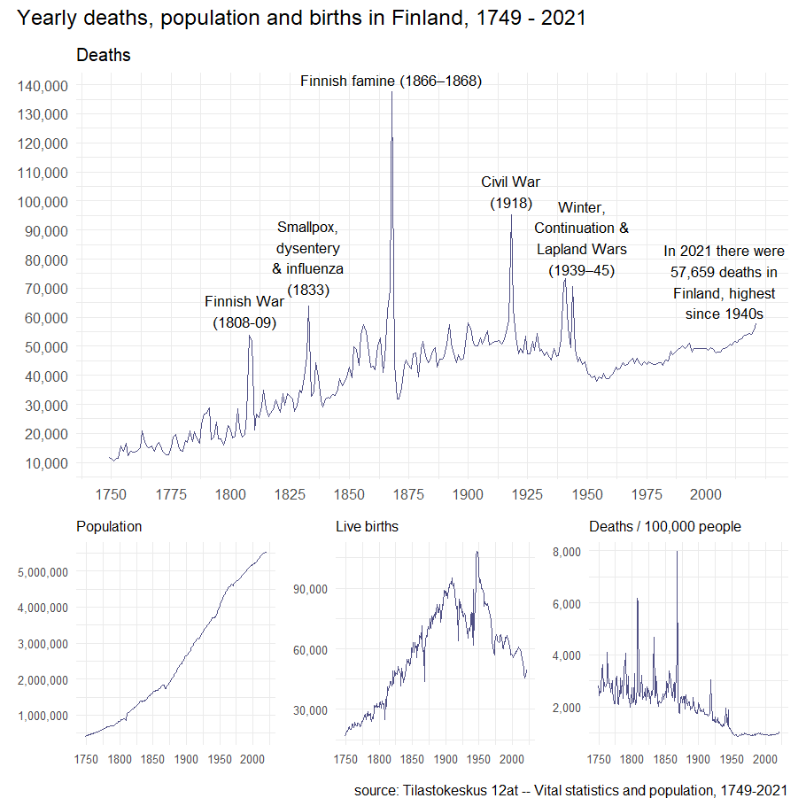
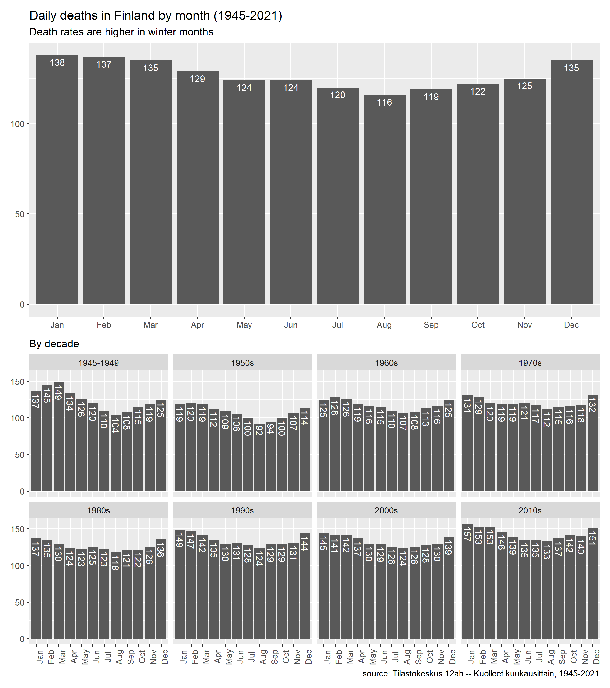
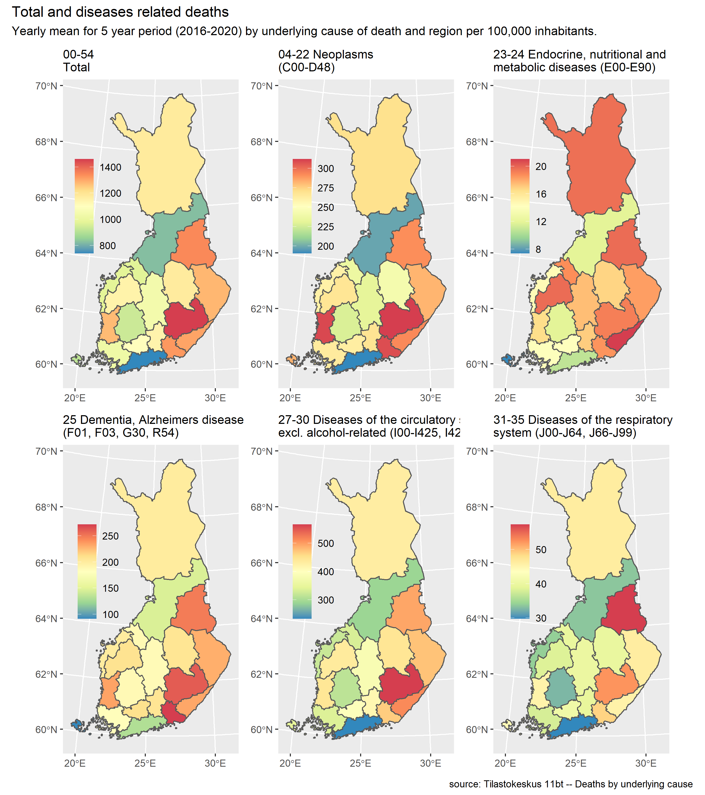
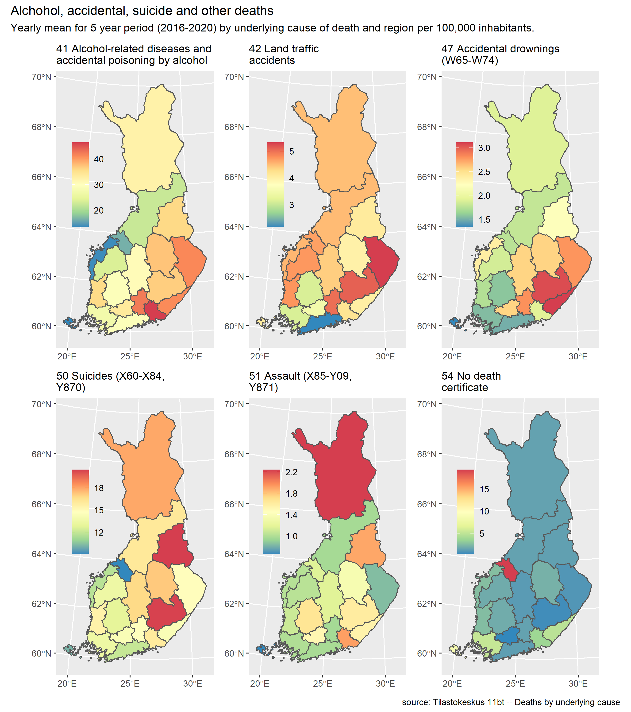
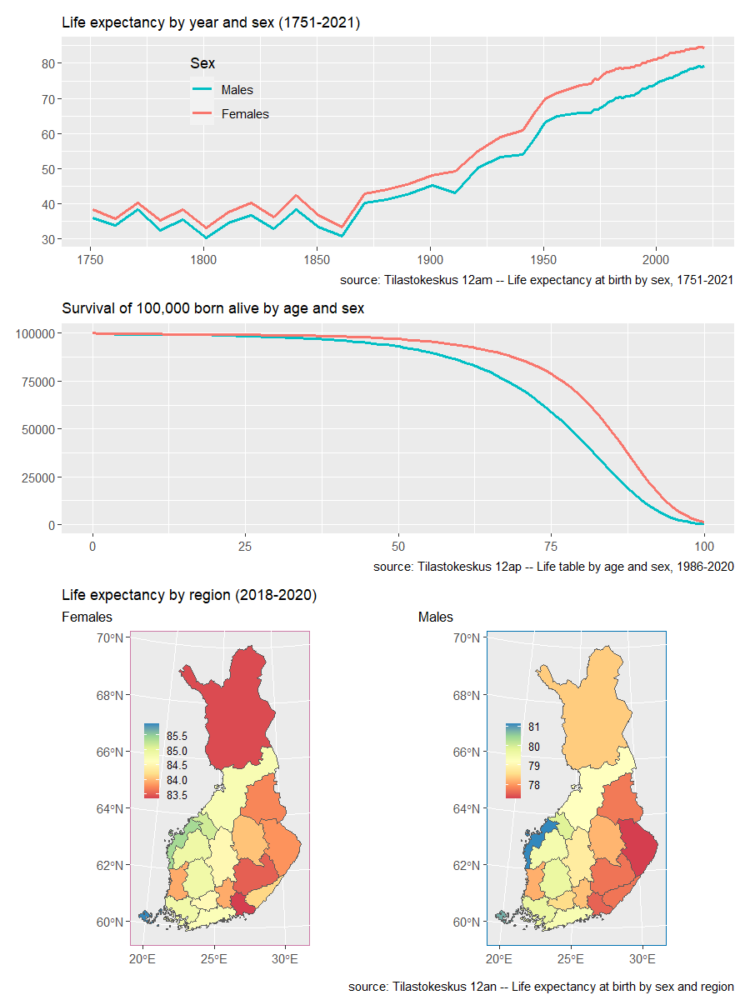

```{r setup, include=FALSE}
knitr::opts_chunk$set(echo = TRUE, eval = FALSE)

```

```{r message=FALSE}
library(tidyverse)
library(patchwork)
library(geofi)
library(pxweb)
library(scales)
library(lubridate)
```

## Deadliest years

```{r}
px_12at <- pxweb_get(url = 
                       "https://statfin.stat.fi:443/PxWeb/api/v1/en/StatFin/kuol/statfin_kuol_pxt_12at.px",
                     query = list("Tiedot"=c("vm01", "vm11", "vaesto"), "Vuosi"=c("*")))

df_12at <- as_tibble(as.data.frame(px_12at, column.name.type = "text", variable.value.type = "text"))

df_12at <- df_12at |>
  rename(Live_births = "Live births") |>
  mutate(Year = as.integer(Year),
         Death_rate = Deaths / Population * 100000)

# Source: http://www.saunalahti.fi/arnoldus/kuolovuo.html
labels = tribble(
  ~Year, ~Deaths, ~Label,
  1868,  137720, "Finnish famine (1866–1868)",
  1918,  92102,  "Civil War\n(1918)",
  1948,  61846,  "Winter,\nContinuation &\nLapland Wars\n(1939–45)",
  1833,  55038,  "Smallpox,\ndysentery\n& influenza\n(1833)",
  1806,  50942,  "Finnish War\n(1808-09)",
  2008,  46659,  "In 2021 there were\n57,659 deaths in\nFinland, highest\nsince 1940s"
)

ggplot(df_12at, aes(Year, Deaths)) +
  geom_line(color = "#505085") +
  scale_x_continuous(breaks = seq(1750, 2020, 25)) +
  scale_y_continuous(labels = scales::comma, breaks = seq(0, 150000, 10000)) +
  geom_text(aes(label=Label), size = 3.3, vjust = -0.5, data=labels) +
  labs(subtitle = "Deaths",
       y = NULL,
       x = NULL) +
  theme_minimal() -> yearly_deaths_plot

yearly_plot <- function(df, y_stat, subtitle) {
  ggplot(df, aes(Year, {{y_stat}})) +
    geom_line(color = "#505085") +
    scale_x_continuous(breaks = seq(1750, 2020, 50)) +
    scale_y_continuous(labels = scales::comma) +
    labs(subtitle = subtitle,
         y = NULL,
         x = NULL) +
    theme_minimal() +
    theme(text = element_text(size = 9))
}

yearly_population_plot <- yearly_plot(df_12at, Population, "Population")
yearly_births_plot <- yearly_plot(df_12at, Live_births, "Live births")
yearly_death_rate_plot <- yearly_plot(df_12at, Death_rate, "Deaths / 100,000 people")

layout <- "
AAA
AAA
BCD
"

plot_yearly <- (yearly_deaths_plot + yearly_population_plot +
                  yearly_births_plot + yearly_death_rate_plot +
                  plot_layout(design = layout)) +
  plot_annotation(title = "Yearly deaths, population and births in Finland, 1749 - 2021",
                  caption = "source: Tilastokeskus 12at -- Vital statistics and population, 1749-2021")

ggsave("images//plot_yearly.png", plot_yearly, device = "png", dpi = 130)

```



## Deadliest months

```{r}
px_12ah <- pxweb_get(url = 
"https://statfin.stat.fi:443/PxWeb/api/v1/fi/StatFin/kuol/statfin_kuol_pxt_12ah.px",
 query = list("Tapahtumakuukausi" = c("M01", "M02", "M03", "M04", "M05", "M06",
                                      "M07", "M08", "M09", "M10", "M11", "M12"),
              "Tiedot"=c("*"), "Vuosi"=c("*")))

df_12ah <- as_tibble(as.data.frame(px_12ah, column.name.type = "text", variable.value.type = "text"))

short_month_names  <- month.abb 
names(short_month_names) <- unique(df_12ah$Tapahtumakuukausi)

df_12ah <- df_12ah |>
  mutate(Tapahtumakuukausi = str_replace_all(Tapahtumakuukausi, short_month_names)) |>
  mutate(Tapahtumakuukausi = as_factor(Tapahtumakuukausi))

avg_days_per_month = c(31, 28.25, 31, 30, 31, 30, 31, 31, 30, 31, 30, 31)

df_12ah |>
  group_by(Tapahtumakuukausi) |>
  summarise(Kuolleet = mean(Kuolleet)) |>
  mutate(deaths_daily = as.integer(Kuolleet / avg_days_per_month)) |>
  ggplot(aes(Tapahtumakuukausi, deaths_daily)) +
  geom_col() +
  geom_text(aes(label = deaths_daily), vjust = 1.5,
            color = "white", size = 3) +
  theme_bw() +
  labs(y = NULL,
       x = NULL) -> daily_deaths_month_plot

df_12ah |>
  mutate(Vuosi = as.integer(Vuosi)) |> 
  mutate(decade = Vuosi - Vuosi %% 10) |>
  filter(decade <= 2010) |>
  mutate(decade = as.character(paste0(decade, "s")),
         decade = str_replace_all(decade, "1940s", "1945-1949")) |>
  group_by(decade, Tapahtumakuukausi) |>
  summarise(deaths = mean(Kuolleet)) |>
  mutate(deaths_daily = as.integer(deaths / avg_days_per_month)) |>
  ggplot(aes(Tapahtumakuukausi, deaths_daily)) +
  geom_col() +
  theme_bw() +
  facet_wrap(vars(decade), nrow = 2) +
  geom_text(aes(label = deaths_daily),
            color = "white", size = 2.2, angle = 270, hjust = -0.1) +
  theme(axis.text.x = element_text(angle = 90, vjust = 0.15)) +
  labs(subtitle = "By decade",
       y = NULL,
       x = NULL,
       caption = "source: Tilastokeskus 12ah -- Kuolleet kuukausittain, 1945-2021"
       ) -> daily_deaths_decade_plot

plot_months <- daily_deaths_month_plot / daily_deaths_decade_plot +
  plot_annotation(title = "Daily deaths in Finland by month (1945-2021)",
                  subtitle = "Death rates are higher in winter months")

ggsave("images//plot_months.png", plot_months, device = "png", dpi = 130)
```



## Region and cause

```{r}
# For causes of death per region
px_11bt <- pxweb_get(url = 
"https://statfin.stat.fi:443/PxWeb/api/v1/en/StatFin/ksyyt/statfin_ksyyt_pxt_11bt.px",
query = list(
"Maakunta" = c("MK01", "MK02", "MK04", "MK05", "MK06", "MK07", "MK08", "MK09", "MK10", 
  "MK11", "MK12", "MK13", "MK14", "MK15", "MK16", "MK17", "MK18", "MK19", "MK21"),
"Tilaston peruskuolemansyy (aikasarjaluokitus)" = c("*"),
"Vuosi" = c("2016", "2017", "2018", "2019", "2020"),
"Tiedot" = c("*")))

df_11bt <- as_tibble(as.data.frame(px_11bt, column.name.type = "text", variable.value.type = "text"))

df_11bt <- df_11bt |>
  rename(Cause = "Underlying cause of death (time series classification)") |>
  mutate(Year = as.integer(Year)) |>
  separate(Region, into = c("ID", "Region"), sep = " ", extra = "merge")

# For population per region
px_11ra <- pxweb_get(url = 
"https://statfin.stat.fi:443/PxWeb/api/v1/fi/StatFin/vaerak/statfin_vaerak_pxt_11ra.px",
query = list(
"Alue" = c("MK01", "MK02", "MK04", "MK05", "MK06", "MK07", "MK08", "MK09", "MK10", 
  "MK11", "MK12", "MK13", "MK14", "MK15", "MK16", "MK17", "MK18", "MK19", "MK21"),
"Vuosi" = c("2016", "2017", "2018", "2019", "2020"),
"Tiedot" = c("vaesto")))

df_11ra <- as_tibble(as.data.frame(px_11ra, column.name.type = "text", variable.value.type = "text"))

df_11ra <- df_11ra |>
  mutate(Vuosi = as.integer(Vuosi)) |>
  rename(Population = "Väestö 31.12.") |>
  separate(Alue, into = c("ID", "Region_fi"), sep = " ", extra = "merge")

df_cause_region <- df_11bt |>
  left_join(df_11ra, by = c("ID" = "ID", "Year" = "Vuosi")) |>
  mutate(Deaths_per_100k = Deaths / Population * 100000) |>
  group_by(Region, Cause) |>
  summarise(Deaths_per_100k = mean(Deaths_per_100k), .groups = "drop")

df_region_map <- get_municipalities(year = 2020, scale = 4500)

df_region_map <- df_region_map |>
  group_by(maakunta_name_en) |>
  summarise() |>
  rename(Region = maakunta_name_en)

df_cause_region <- df_region_map |>
  left_join(df_cause_region, by = "Region")

by_cause <- function(cause_1, title_1){

  df_cause_region |>
    filter(Cause == cause_1) |>
    ggplot() + 
    geom_sf(aes(geometry = geom, fill = Deaths_per_100k)) +
    scale_fill_distiller(palette = "Spectral") +
    labs(subtitle = title_1, fill = NULL) +
    theme(legend.position = c(0.18, 0.61),
          legend.background = element_blank(),
          legend.key.size = unit(0.18, "in"),
          legend.text = element_text(size = 7),
          plot.subtitle = element_text(size = 8))
}

p1 <- by_cause("00-54 Total",
               "Total")
p2 <- by_cause("04-22 Neoplasms (C00-D48)",
               "Neoplasms (cancer)")
p3 <- by_cause("23-24 Endocrine, nutritional and metabolic diseases (E00-E90)",
               "Endocrine, nutritional and\nmetabolic diseases")

p4 <- by_cause("25 Dementia, Alzheimers disease (F01, F03, G30, R54)",
               "Dementia, Alzheimers disease")
p5 <- by_cause("27-30 Diseases of the circulatory system excl. alcohol-related (I00-I425, I427-I99)",
               "Diseases of the circulatory\nsystem excl. alcohol-related")
p6 <- by_cause("31-35 Diseases of the respiratory system (J00-J64, J66-J99)",
               "Diseases of the respiratory system")

p7 <- by_cause("41 Alcohol-related diseases and accidental poisoning by alcohol",
               "Alcohol-related diseases and\naccidental alcohol poisonings")
p8 <- by_cause("42 Land traffic accidents",
               "Land traffic accidents")
p9 <- by_cause("47 Accidental drownings (W65-W74)",
               "Accidental drownings")

p10 <- by_cause("50 Suicides (X60-X84, Y870)",
                "Suicide")
p11 <- by_cause("51 Assault (X85-Y09, Y871)",
                "Assault")
p12 <- by_cause("54 No death certificate",
                "No death certificate")

plot_regions_1 <- ((p1 | p2 | p3) /  
                     (p4 | p5 | p6)) + 
  plot_annotation(title = "Total and diseases related deaths",
                  subtitle = paste0("Yearly mean for 5 year period (2016-2020) ",
                                    "by cause of death and region per 100,000 inhabitants"),
                  caption = "source: Tilastokeskus 11bt -- Deaths by underlying cause")

plot_regions_2 <- (p7 | p8 | p9) /
  (p10 | p11 | p12) +
  plot_annotation(title = "Alchohol, accidental, suicide and other deaths",
                  subtitle = paste0("Yearly mean for 5 year period (2016-2020) ",
                                    "by cause of death and region per 100,000 inhabitants"),
                  caption = "source: Tilastokeskus 11bt -- Deaths by underlying cause")

ggsave("images//plot_regions_1.png", plot_regions_1, device = "png", dpi = 130)
ggsave("images//plot_regions_2.png", plot_regions_2, device = "png", dpi = 130)
```




## Life expectancy

```{r}
px_12am <- pxweb_get(url = 
"https://statfin.stat.fi:443/PxWeb/api/v1/en/StatFin/kuol/statfin_kuol_pxt_12am.px",
query = list( "Sukupuoli" = c("1", "2"), "Vuosi" = c("*"), "Tiedot" = c("*")))

df_12am <- as_tibble(as.data.frame(px_12am, column.name.type = "text", variable.value.type = "text"))

df_12am <- df_12am |>
  rename(Life_exp = "Life expectancy at birth, years") |>
  mutate(Year = str_sub(Year, 1, 4)) |>
  mutate(Year = as.integer(Year),
         Sex = as_factor(Sex))

ggplot(df_12am, aes(Year, Life_exp, color = Sex)) +
  geom_line(size = 1.1) +
  scale_colour_hue(direction = -1) +
  theme(legend.position = c(0.25, 0.75),
        legend.background = element_blank(),
        plot.title = element_text(hjust = 0.06),
        plot.tag.position = c(0.2, 1)) +
  labs(subtitle = "Life expectancy by year and sex (1751-2021)", y = NULL, x = NULL,
       caption = "source: Tilastokeskus 12am -- Life expectancy at birth by sex, 1751-2021"
       ) -> life_exp_plot

# Survivors of 100k born alive

px_12ap <- pxweb_get(url = 
"https://statfin.stat.fi:443/PxWeb/api/v1/en/StatFin/kuol/statfin_kuol_pxt_12ap.px",
query = list("Sukupuoli" = c("1", "2"), "Vuosi" = c("*"),
              "Tiedot" = c("elo100000synt")))

df_12ap <- as_tibble(as.data.frame(px_12ap, column.name.type = "text", variable.value.type = "text"))

df_12ap |>
  rename(survivors_100k = "Survivors of 100,000 born alive") |>
  mutate(Sex = as_factor(Sex),
         Year = as.integer(Year),
         Age = as.integer(Age)) |>
  group_by(Sex, Age) |>
  summarise(survivors_100k = mean(survivors_100k)) |>
  ggplot(aes(Age, survivors_100k, color = Sex)) +
  geom_line(size = 1.1) +
  scale_colour_hue(direction = -1) +
  theme(legend.position = "none",
        plot.title = element_text(hjust = 0.06),
        plot.tag.position = c(0.2, 1)) +
  labs(subtitle = "Survival of 100,000 born alive by age and sex", y = NULL, x = NULL,
       caption = "source: Tilastokeskus 12ap -- Life table by age and sex, 1986-2020"
  ) -> survivors_plot


# Life expectancy by region
px_12an <- pxweb_get(url = 
                       "https://statfin.stat.fi:443/PxWeb/api/v1/en/StatFin/kuol/statfin_kuol_pxt_12an.px",
                     query = list(
                       "Maakunta" = c("MK01", "MK02", "MK04", "MK05", "MK06", "MK07", "MK08", "MK09", "MK10", 
                                      "MK11", "MK12", "MK13", "MK14", "MK15", "MK16", "MK17", "MK18", "MK19", "MK21"),
                       "Vuosi" = c("2020"),
                       "Sukupuoli" = c("1", "2"),
                       "Tiedot" = c("*")))

df_12an <- as_tibble(as.data.frame(px_12an, column.name.type = "text", variable.value.type = "text"))

df_12an <- df_12an |> 
  rename(Life_exp = "Life expectancy at birth, years") |>
  mutate(Region = str_remove_all(Region, "MK.. "))

df_life_region <- df_region_map |>
  left_join(df_12an, by = c("Region"))

df_life_region |>
  filter(Sex == "Females") |>
  ggplot() + 
  geom_sf(aes(geometry = geom, fill = Life_exp)) +
  scale_fill_distiller(palette = "Spectral", direction = 1) +
  labs(title = "Life expectancy by region (2018-2020)", subtitle = "Females", fill = NULL) +
  theme(legend.position = c(0.2, 0.6),
        legend.background = element_blank(),
        legend.key.size = unit(0.15, "in"),
        legend.text = element_text(size = 8),
        panel.background = element_rect(colour = "#CC79A7"),
        plot.margin = margin(r = 0, unit = "cm"),
        plot.title = element_text(size = 11),
        plot.subtitle = element_text(size = 10)
  ) -> life_exp_region_f_plot

df_life_region |>
  filter(Sex == "Males") |>
  ggplot() + 
  geom_sf(aes(geometry = geom, fill = Life_exp)) +
  scale_fill_distiller(palette = "Spectral", direction = 1) +
  labs(subtitle = "Males", fill = NULL) +
  theme(legend.position = c(0.2, 0.6),
        legend.background = element_blank(),
        legend.key.size = unit(0.15, "in"),
        legend.text = element_text(size = 8),
        panel.background = element_rect(colour = "#0072B2"),
        plot.subtitle = element_text(size = 10)
  ) -> life_exp_region_m_plot

layout <- "
AA
AA
BB
BB
CD
CD
CD
"

plot_life_exp <- (life_exp_plot + survivors_plot +
 life_exp_region_f_plot + life_exp_region_m_plot +
    plot_layout(design = layout)) +
  plot_annotation(caption = "source: Tilastokeskus 12an -- Life expectancy at birth by sex and region")

ggsave("images//plot_life_exp.png", plot_life_exp, device = "png", dpi = 120,
       width = 7.5, height = 10, units = c("in"))

```

