```{r setup, include=FALSE}
knitr::opts_chunk$set(echo = TRUE, eval = FALSE)

```

```{r message=FALSE}
library(tidyverse)
library(patchwork)
library(geofi)
library(pxweb)
library(scales)
library(lubridate)
library(data.table)
library(gridExtra)
```

## History

```{r}
px_12at <- pxweb_get(url = 
"https://statfin.stat.fi:443/PxWeb/api/v1/en/StatFin/kuol/statfin_kuol_pxt_12at.px",
query = list("Tiedot"=c("vm01", "vm11", "vaesto"), "Vuosi"=c("*")))

df_12at <- as_tibble(as.data.frame(px_12at, column.name.type = "text", variable.value.type = "text"))

df_12at <- df_12at |>
  rename(Live_births = "Live births") |>
  mutate(Year = as.integer(Year),
         Death_rate = Deaths / Population * 100000)

# Source: http://www.saunalahti.fi/arnoldus/kuolovuo.html
labels = tribble(
  ~Year, ~Deaths, ~Label,
  1868,  137720, "Finnish famine (1866–1868)",
  1918,  92102,  "Civil War\n(1918)",
  1948,  63846,  "Winter,\nContinuation &\nLapland Wars\n(1939–45)",
  1833,  55038,  "Smallpox,\ndysentery\n& influenza\n(1833)",
  1806,  51942,  "Finnish War\n(1808-09)",
  2008,  48659,  "In 2021 there were\n57,659 deaths in\nFinland, highest\nsince 1940s"
)

ggplot(df_12at, aes(Year, Deaths)) +
  geom_line(size = 1.1, color = "#505085") +
  scale_x_continuous(breaks = seq(1750, 2020, 25)) +
  scale_y_continuous(labels = scales::comma, breaks = seq(0, 150000, 10000)) +
  geom_text(aes(label=Label), size = 4.5, vjust = -0.5, data=labels) +
  labs(subtitle = "Deaths",
       y = NULL,
       x = NULL) +
  theme_minimal() -> yearly_deaths_plot

yearly_plot <- function(df, y_stat, subtitle) {
  ggplot(df, aes(Year, {{y_stat}})) +
    geom_line(color = "#505085") +
    scale_x_continuous(breaks = seq(1750, 2020, 50)) +
    scale_y_continuous(labels = scales::comma) +
    labs(subtitle = subtitle,
         y = NULL,
         x = NULL) +
    theme_minimal() +
    theme(text = element_text(size = 11))
}

yearly_population_plot <- yearly_plot(df_12at, Population, "Population")
yearly_births_plot <- yearly_plot(df_12at, Live_births, "Live births")
yearly_death_rate_plot <- yearly_plot(df_12at, Death_rate, "Deaths / 100,000 people")

layout <- "
AAA
AAA
BCD
"

(yearly_deaths_plot + yearly_population_plot +
                  yearly_births_plot + yearly_death_rate_plot +
                  plot_layout(design = layout)) +
plot_annotation(title = "Yearly deaths, population and births in Finland, 1749 - 2021",
caption = "source: Tilastokeskus 12at -- Vital statistics and population, 1749-2021"
) -> plot_yearly

ggsave("images//1_plot_yearly.png", plot_yearly, device = "png", dpi = 96,
       width = 9, height = 9, units = c("in"))

```


## Region and cause (2016 - 2020)

```{r}
# Get the correspondence table between municipalities and regions in 2020
# https://www.stat.fi/en/luokitukset/corrmaps/kunta_1_20200101%23maakunta_1_20200101/
region_keys_2020 <- fread("kunta_1_20200101%23maakunta_1_20200101.csv", encoding = "Latin-1",
                          col.names = c("id_1", "Municipality", "id_2", "Region"), header = F)

# Get populations and ages per region per year
px_11rf <- pxweb_get(url = 
"https://statfin.stat.fi:443/PxWeb/api/v1/en/StatFin/vaerak/statfin_vaerak_pxt_11rf.px",
query = list(
"Kunta" = c("*"),
"Sukupuoli" = c("1", "2"),
"Vuosi" = c("2016", "2017", "2018", "2019", "2020"),
"Ikä" = c("*"),
"Tiedot" = c("*")))

df_11rf <- as_tibble(as.data.frame(px_11rf, column.name.type = "text", variable.value.type = "text"))

df_11rf |>
  drop_na() |>
  filter(Municipality != "WHOLE COUNTRY",
         Age != "Total") |>
  left_join(region_keys_2020, by = "Municipality") |>
  mutate(Age = ifelse(Age == "100 -", "100", Age),
         Age = as.integer(Age)) |>
  mutate(Age_group = case_when(Age == 0 ~ "0",
                               between(Age, 1, 4) ~ "1 - 4",
                               between(Age, 5, 9) ~ "5 - 9",
                               between(Age, 10, 14) ~ "10 - 14",
                               between(Age, 15, 19) ~ "15 - 19",
                               between(Age, 20, 24) ~ "20 - 24",
                               between(Age, 25, 29) ~ "25 - 29",
                               between(Age, 30, 34) ~ "30 - 34",
                               between(Age, 35, 39) ~ "35 - 39",
                               between(Age, 40, 44) ~ "40 - 44",
                               between(Age, 45, 49) ~ "45 - 49",
                               between(Age, 50, 54) ~ "50 - 54",
                               between(Age, 55, 59) ~ "55 - 59",
                               between(Age, 60, 64) ~ "60 - 64",
                               between(Age, 65, 69) ~ "65 - 69",
                               between(Age, 70, 74) ~ "70 - 74",
                               between(Age, 75, 79) ~ "75 - 79",
                               between(Age, 80, 84) ~ "80 - 84",
                               between(Age, 85, 89) ~ "85 - 89",
                               between(Age, 90, 94) ~ "90 - 94",
                               between(Age, 95, 150) ~ "95 -",)) |>
  rename(Population = "Population 31 Dec") |>
  select(Municipality, Year, Sex, Population, Region, Age_group) |>
  rename(Age = Age_group) |>
  mutate(Region = case_when(Municipality == "Juankoski" ~ "North Savo",
                              Municipality == "Luvia" ~ "Satakunta",
                              Municipality == "Valtimo" ~ "North Karelia",
                              TRUE ~ Region)) |>
  group_by(Region, Year, Age, Sex) |>
  summarise(Population = sum(Population)) -> df_11rf

df_11rf |>
  group_by(Year, Age, Sex) |>
  summarise(Population_All_Regions = sum(Population)) -> df_all_regions

df_11rf |>
  left_join(df_all_regions, by = c("Year", "Age", "Sex")) -> df_11rf

# Get Deaths by Underlying cause of death (time series classification), Age, Information, Gender and Year
px_11bs <- pxweb_get(url = 
"https://statfin.stat.fi:443/PxWeb/api/v1/en/StatFin/ksyyt/statfin_ksyyt_pxt_11bs.px",
query = list(
"Tilaston peruskuolemansyy (aikasarjaluokitus)" = c("*"),
"Sukupuoli" = c("1", "2"),
"Vuosi" = c("2016", "2017", "2018", "2019", "2020"),
"Ikä" = c("*"),
"Tiedot" = c("*")))

df_11bs <- as_tibble(as.data.frame(px_11bs, column.name.type = "text", variable.value.type = "text"))

df_11bs$`Underlying cause of death (time series classification)` |> unique() -> causes

df_11bs |>
  rename(Cause = "Underlying cause of death (time series classification)",
         Sex = Gender) |>
  filter(Age != "Total") -> df_11bs

df_11rf |>
  left_join(df_11bs, by = c("Age", "Sex", "Year")) |>
  rename(Deaths_All_Regions = Deaths) |>
  mutate(Expected = (Population / Population_All_Regions) * Deaths_All_Regions) |>
  group_by(Region, Cause) |>
  summarise(Expected = round(sum(Expected), 2)) -> df_11rf

# For causes of death per region
px_11bt <- pxweb_get(url = 
 "https://statfin.stat.fi:443/PxWeb/api/v1/en/StatFin/ksyyt/statfin_ksyyt_pxt_11bt.px",
query = list(
 "Maakunta" = c("MK01", "MK02", "MK04", "MK05", "MK06", "MK07", "MK08", "MK09", "MK10", 
                "MK11", "MK12", "MK13", "MK14", "MK15", "MK16", "MK17", "MK18", "MK19", "MK21"),
 "Tilaston peruskuolemansyy (aikasarjaluokitus)" = c("*"),
 "Vuosi" = c("2016", "2017", "2018", "2019", "2020"),
 "Tiedot" = c("*")))

df_11bt <- as_tibble(as.data.frame(px_11bt, column.name.type = "text", variable.value.type = "text"))

# For Finnish translations
px_11bt_fi <- pxweb_get(url = 
"https://pxdata.stat.fi:443/PxWeb/api/v1/fi/StatFin/ksyyt/statfin_ksyyt_pxt_11bt.px",
query = list(
"Maakunta" = c("MK01", "MK02", "MK04", "MK05", "MK06", "MK07", "MK08", "MK09", "MK10", 
            "MK11", "MK12", "MK13", "MK14", "MK15", "MK16", "MK17", "MK18", "MK19", "MK21"),
"Tilaston peruskuolemansyy (aikasarjaluokitus)" = c("*"),
"Vuosi" = c("2020"),
"Tiedot" = c("*")))

df_11bt_fi <- as_tibble(as.data.frame(px_11bt_fi, column.name.type = "text", variable.value.type = "text"))

df_11bt_fi |>
  rename(Cause_fi = "Tilaston peruskuolemansyy (aikasarjaluokitus)") |>
  separate(Maakunta, into = c("ID", "Region_fi"), sep = " ", extra = "merge") |>
  mutate(Cause_id = str_match(Cause_fi, "[:graph:]+[:space:]")) |>
  select(ID, Region_fi, Cause_fi, Cause_id) -> df_11bt_fi

df_11bt |>
  rename(Cause = "Underlying cause of death (time series classification)") |>
  mutate(Year = as.integer(Year)) |>
  separate(Region, into = c("ID", "Region"), sep = " ", extra = "merge") |>
  group_by(ID, Region, Cause) |>
  summarise(Deaths = sum(Deaths)) |>
  mutate(Cause_id = str_match(Cause, "[:graph:]+[:space:]")) -> df_11bt

df_11bt |>
  left_join(df_11bt_fi, by = c("ID", "Cause_id")) -> df_11bt

df_11rf |>
  left_join(df_11bt, by = c("Region", "Cause")) |>
  mutate(SMR = round(Deaths / Expected, 2)) |> # Standardized mortality ratio
  select(Region_fi, Region,  Cause_fi, Cause, Deaths, Expected, SMR
         ) -> df_11rf

# Get map
df_region_map <- get_municipalities(year = 2020, scale = 4500)

df_region_map <- df_region_map |>
  group_by(maakunta_name_en) |>
  summarise() |>
  rename(Region = maakunta_name_en)

df_cause_region <- df_region_map |>
  left_join(df_11rf, by = "Region")

# Function: Create plots
by_cause <- function(cause_en){
  
  df_cause_region |>
    filter(Cause == cause_en) -> df
  
  subtitle_1 <- paste0(df[["Cause"]][[1]], "\n",
                   df[["Cause_fi"]][[1]])
  
  subtitle_1 <- str_remove_all(subtitle_1, "\\(.+\\)") 
  
  ggplot(df) + 
    geom_sf(aes(geometry = geom, fill = SMR)) +
    scale_fill_gradient2(low = muted("blue"),
                          mid = "white",
                          high = muted("red"),
                          midpoint = 1,
                          space="Lab") + 
    labs(fill = NULL) +
    theme(legend.position = c(0.2, 0.65),
          legend.background = element_blank(),
          legend.key.size = unit(0.2, "in"),
          legend.text = element_text(size = 9),
          plot.title = element_text(size = 11),
          plot.subtitle = element_text(size = 10),
          plot.title.position = "plot") -> p
  
  df |>
    ungroup() |>
    filter(Cause == cause_en) |>
    column_to_rownames(var = "Region_fi") |>
    arrange(desc(SMR)) |>
    select(Deaths, Expected, SMR) -> df  
  
  p <- p + tableGrob(df, theme = ttheme_default(base_size = 9)) +
    plot_annotation(title = "Deaths vs expected deaths (2016-2020) for:",
                    subtitle = subtitle_1,
                    theme = theme(plot.title = element_text(size = 11),
                          plot.subtitle = element_text(size = 14)))
}

# Save plots
for (i in seq(from = 1, to = length(causes))) {
  p <- by_cause(causes[i])
  name = paste0("images//region//", as.character(i), ".png")
  ggsave(filename = name, p, device = "png", dpi = 96,
         width = 7.3, height = 6, units = c("in"))
}
```

Deaths in this section were calculated as sums of deaths for a five year period between 2016 and 2020 for each region. Expected deaths were calculated by comparing all deaths in Finland for the same period and standardizing them for each region by age, sex and population. Then deaths were divided by expected deaths to get Standardized Mortality Ratio (SMR). SMR over 1 is represented with red, around 1 with white and under 1 with blue.

Sources:

[Deaths by underlying cause of death and region](https://statfin.stat.fi/PxWeb/pxweb/en/StatFin/StatFin__ksyyt/statfin_ksyyt_pxt_11bt.px/)

[Deaths by underlying cause of death, age and gender for standardization](https://statfin.stat.fi/PxWeb/pxweb/en/StatFin/StatFin__ksyyt/statfin_ksyyt_pxt_11bs.px/)

[Populations and ages per region per year](https://statfin.stat.fi/PxWeb/pxweb/en/StatFin/StatFin__vaerak/statfin_vaerak_pxt_11rf.px/)

[Correspondence table between municipalities and regions (2020)](https://www.stat.fi/en/luokitukset/corrmaps/kunta_1_20200101%23maakunta_1_20200101)

[Finnish translations](https://statfin.stat.fi/PxWeb/pxweb/fi/StatFin/StatFin__ksyyt/statfin_ksyyt_pxt_11bt.px/)

[Municipality-based statistical units for the map](https://www.stat.fi/org/avoindata/paikkatietoaineistot/kuntapohjaiset_tilastointialueet_en.html)


### 0-3 - Totals and certain infectious diseases
<button class="btn btn-light" data-toggle="collapse" data-target="#Block1"> Show/Hide </button>  
<div id="Block1" class="collapse in">  


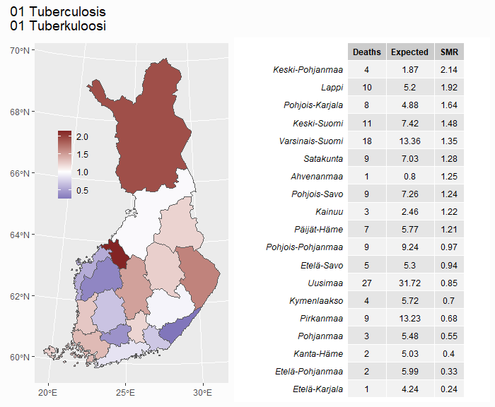


</div>

### 4-22 - Neoplasms (cancers)
<button class="btn btn-light" data-toggle="collapse" data-target="#Block2"> Show/Hide </button>  
<div id="Block2" class="collapse">  


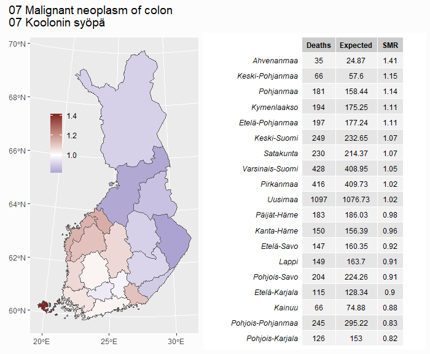
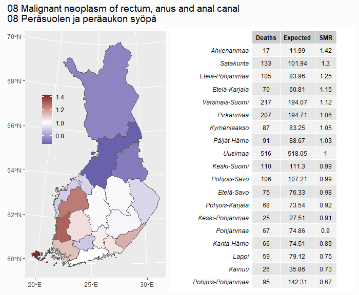


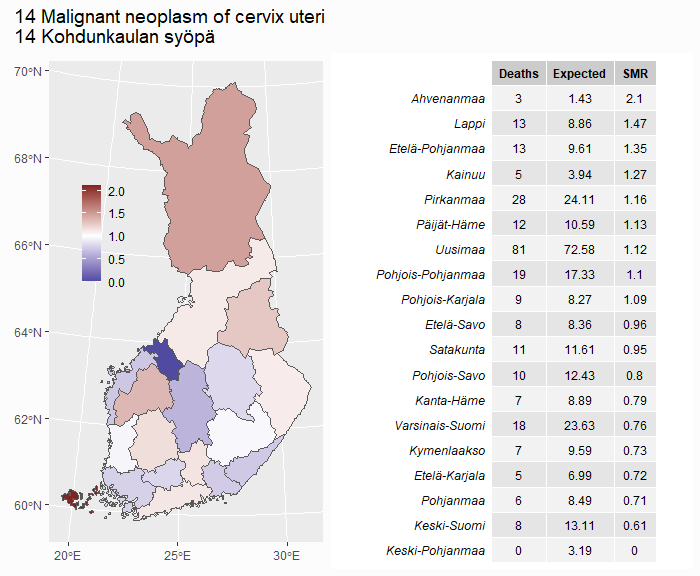
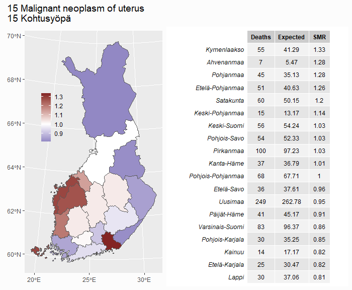


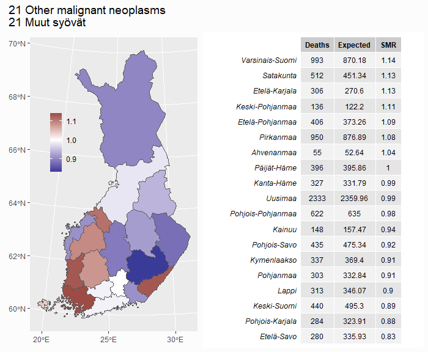

</div>

### 23-30 - Endocrine, nutritional, metabolic, circulatory
<button class="btn btn-light" data-toggle="collapse" data-target="#Block3"> Show/Hide </button>  
<div id="Block3" class="collapse">  

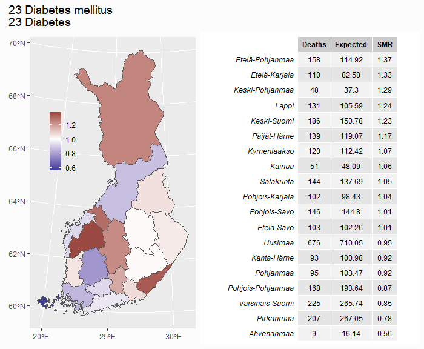


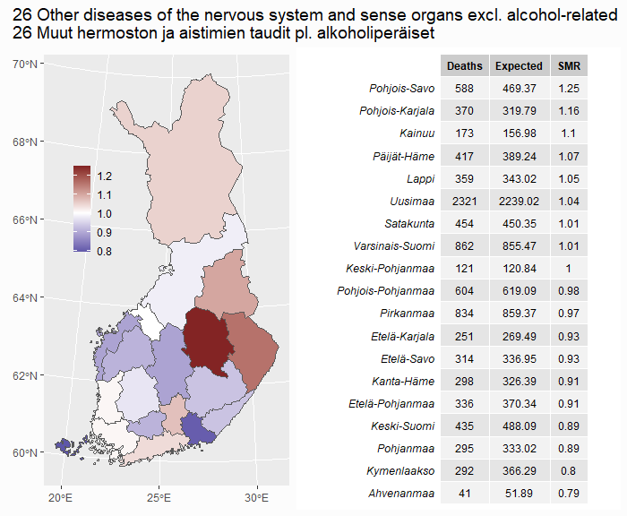


</div>

### 31-35 - Diseases of the respiratory system
<button class="btn btn-light" data-toggle="collapse" data-target="#Block4"> Show/Hide </button>  
<div id="Block4" class="collapse">  
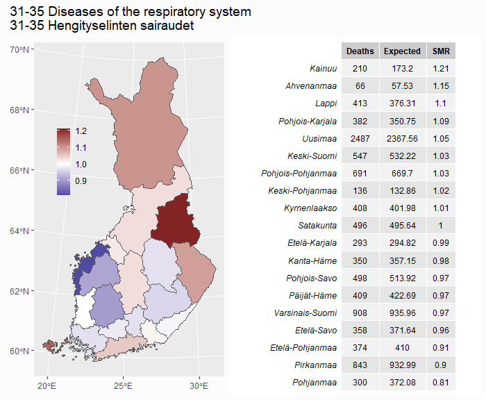


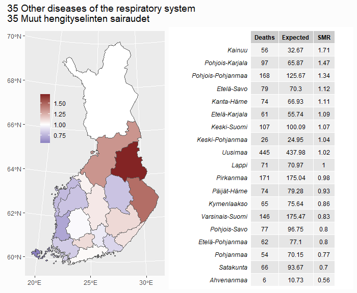
</div>

### 36-39 - Other diseases 
<button class="btn btn-light" data-toggle="collapse" data-target="#Block5"> Show/Hide </button>  
<div id="Block5" class="collapse">  
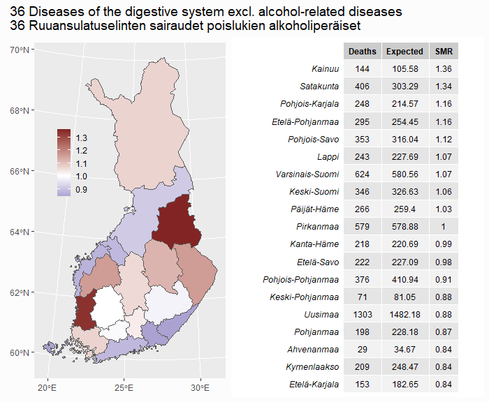


</div>

### 40-54 Alcohol-related, accidents, violence and unknown 
<button class="btn btn-light" data-toggle="collapse" data-target="#Block6"> Show/Hide </button>  
<div id="Block6" class="collapse">  


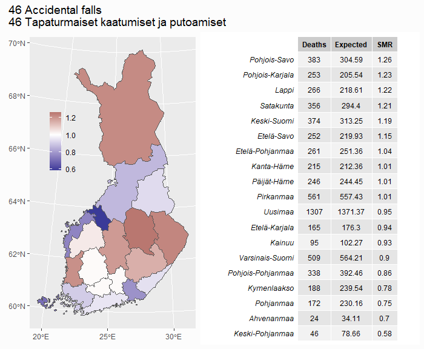
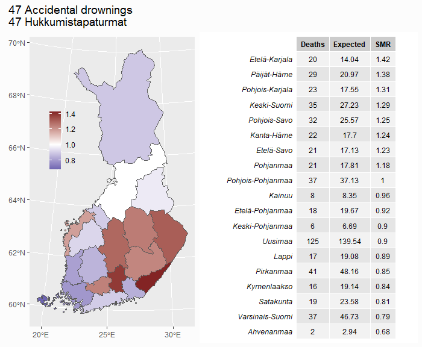


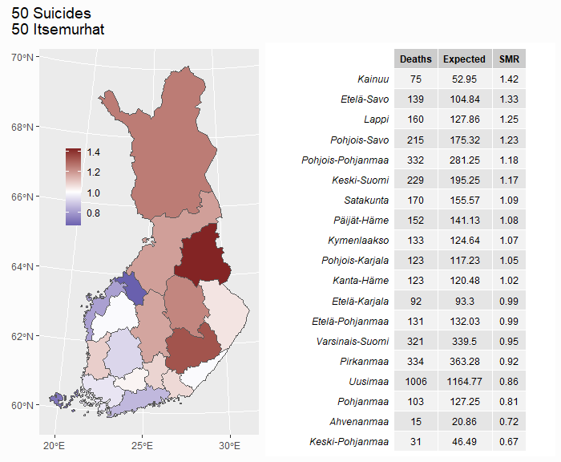


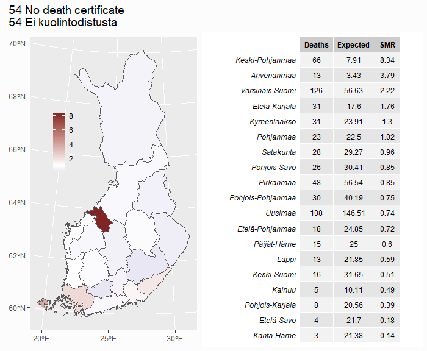
</div>

## Deadliest months

```{r}
px_12ah <- pxweb_get(url = 
"https://statfin.stat.fi:443/PxWeb/api/v1/en/StatFin/kuol/statfin_kuol_pxt_12ah.px",
 query = list("Tapahtumakuukausi" = c("M01", "M02", "M03", "M04", "M05", "M06",
                                      "M07", "M08", "M09", "M10", "M11", "M12"),
              "Tiedot"=c("*"), "Vuosi"=c("*")))

df_12ah <- as_tibble(as.data.frame(px_12ah, column.name.type = "text", variable.value.type = "text"))

avg_days_per_month = c(31, 28.25, 31, 30, 31, 30, 31, 31, 30, 31, 30, 31)

df_12ah |>
  rename(Month = "Month of occurrence") |>
  mutate(Year = as.integer(Year),
         Month = as_factor(Month),
         Deaths_daily = as.integer(Deaths / avg_days_per_month),
         Month_short = as_factor(rep(month.abb, n()/12)),
         Decade = as.character(paste0(Year - Year %% 10, "s")),
         Decade = str_replace_all(Decade, "1940s", "1945-1949")
         ) -> df_12ah

df_12ah |>
  group_by(Month) |>
  summarise(Deaths_daily = round(mean(Deaths_daily))) |>
  ggplot(aes(Month, Deaths_daily)) +
  geom_col() +
  geom_text(aes(label = Deaths_daily), vjust = 1.5,
            color = "white", size = 4) +
  theme_bw() +
  labs(y = NULL,
       x = NULL) -> daily_deaths_month_plot

df_12ah |>
  filter(Decade != "2020s") |>
  group_by(Decade, Month_short) |>
  summarise(Deaths_daily = round(mean(Deaths_daily))) |>
  ggplot(aes(Month_short, Deaths_daily)) +
  geom_col() +
  theme_bw() +
  facet_wrap(vars(Decade), nrow = 2) +
  geom_text(aes(label = Deaths_daily),
            color = "white", size = 3.2, angle = 270, hjust = -0.1) +
  theme(axis.text.x = element_text(angle = 90, vjust = 0.15)) +
  labs(subtitle = "By decade",
       y = NULL,
       x = NULL,
       caption = "source: Tilastokeskus 12ah -- Deaths by month, 1945-2021"
       ) -> daily_deaths_decade_plot

plot_months <-  daily_deaths_month_plot / daily_deaths_decade_plot +
  plot_annotation(title = "Daily deaths in Finland by month (1945-2021)",
                  subtitle = "Death rates are higher in winter months")

ggsave("images//2_plot_months.png", plot_months, device = "png", dpi = 96,
       width = 9, height = 9, units = c("in"))
```


## Life expectancy by sex

```{r}
px_12am <- pxweb_get(url = 
"https://statfin.stat.fi:443/PxWeb/api/v1/en/StatFin/kuol/statfin_kuol_pxt_12am.px",
query = list( "Sukupuoli" = c("1", "2"), "Vuosi" = c("*"), "Tiedot" = c("*")))

px_12am <- pxweb_get(url = 
"https://statfin.stat.fi:443/PxWeb/api/v1/en/StatFin/kuol/statfin_kuol_pxt_12am.px",
query = list( "Sukupuoli" = c("1", "2"), "Vuosi" = c("*"), "Tiedot" = c("*")))

df_12am <- as_tibble(as.data.frame(px_12am, column.name.type = "text", variable.value.type = "text"))

df_12am <- df_12am |>
  rename(Life_exp = "Life expectancy at birth, years") |>
  mutate(Year = str_sub(Year, 1, 4)) |>
  mutate(Year = as.integer(Year),
         Sex = as_factor(Sex))

ggplot(df_12am, aes(Year, Life_exp, color = Sex)) +
  geom_line(size = 1.1) +
  scale_colour_hue(direction = -1) +
  theme(legend.position = c(0.25, 0.75),
        legend.background = element_blank(),
        plot.title = element_text(hjust = 0.06),
        plot.tag.position = c(0.2, 1)) +
  labs(subtitle = "Life expectancy by year (1751-2021)", y = "age", x = "year"
       ) -> life_plot_1

# Survivors of 100k born alive

px_12ap <- pxweb_get(url = 
"https://statfin.stat.fi:443/PxWeb/api/v1/en/StatFin/kuol/statfin_kuol_pxt_12ap.px",
query = list("Sukupuoli" = c("1", "2"), "Vuosi" = c("*"), "Tiedot" = c("*")))

df_12ap <- as_tibble(as.data.frame(px_12ap, column.name.type = "text", variable.value.type = "text"))

df_12ap <- df_12ap |>
  mutate(Age = as.integer(Age),
         Year = as.integer(Year),
         Sex = as_factor(Sex)) |>
  rename(Life_exp = "Life expectancy, years",
         Survivors = "Survivors of 100,000 born alive",
         Death_prob = "Probability of death, per mille") |>
  group_by(Sex, Age) |>
  summarise(Life_exp = mean(Life_exp),
            Survivors = mean(Survivors),
            Death_prob = mean(Death_prob)) |>
  mutate(Death_prob = Death_prob / 10) # Changing to percent 

ggplot(df_12ap, aes(Age, Life_exp, color = Sex)) +
  geom_line(size = 1.1) +
  scale_colour_hue(direction = -1) +
  theme(legend.position = "none") +
  labs(subtitle = "Remaining life expectancy (1986-2020)", y = "years", x = "age"
  ) -> life_plot_2

ggplot(df_12ap, aes(Age, Survivors, color = Sex)) +
  geom_line(size = 1.1) +
  scale_colour_hue(direction = -1) +
  scale_y_continuous(labels = scales::comma) +
  theme(legend.position = "none") +
  labs(subtitle = "Survival of 100,000 born alive (1986-2020)", y = "survivors", x = "age"
  ) -> life_plot_3

ggplot(df_12ap, aes(Age, Death_prob, color = Sex)) +
  geom_line(size = 1.1, na.rm = T) +
  scale_colour_hue(direction = -1) +
  theme(legend.position = "none") +
  labs(subtitle = "Yearly probability of death (1986-2020)", y = "percent", x = "age"
  ) -> life_plot_4


plot_life_exp_1 <- (life_plot_1 / life_plot_2 | life_plot_3 / life_plot_4) +
  plot_annotation(title = "Longetivity by sex",
                  caption = "sources: Tilastokeskus 12am (1751-2021) & 12ap (1986-2020)")

# Life expectancy by region
px_12an <- pxweb_get(url = 
                       "https://statfin.stat.fi:443/PxWeb/api/v1/en/StatFin/kuol/statfin_kuol_pxt_12an.px",
                     query = list(
                       "Maakunta" = c("MK01", "MK02", "MK04", "MK05", "MK06", "MK07", "MK08", "MK09", "MK10", 
                                      "MK11", "MK12", "MK13", "MK14", "MK15", "MK16", "MK17", "MK18", "MK19", "MK21"),
                       "Vuosi" = c("2020"),
                       "Sukupuoli" = c("1", "2"),
                       "Tiedot" = c("*")))

df_12an <- as_tibble(as.data.frame(px_12an, column.name.type = "text", variable.value.type = "text"))

df_12an <- df_12an |> 
  rename(Life_exp = "Life expectancy at birth, years") |>
  mutate(Region = str_remove_all(Region, "MK.. "))

df_life_region <- df_region_map |>
  left_join(df_12an, by = c("Region"))

df_life_region |>
  filter(Sex == "Females") |>
  ggplot() + 
  geom_sf(aes(geometry = geom, fill = Life_exp)) +
  scale_fill_distiller(palette = "Spectral", direction = 1, n.breaks = 9) +
  labs(subtitle = "Females", fill = NULL) +
  theme(legend.position = c(0.15, 0.63),
        legend.background = element_blank(),
        legend.key.size = unit(0.4, "in"),
        legend.text = element_text(size = 9),
        panel.background = element_rect(colour = "#CC79A7"),
        plot.margin = margin(r = 1, unit = "cm"),
        plot.subtitle = element_text(size = 13)
  ) -> life_exp_region_f_plot

df_life_region |>
  filter(Sex == "Males") |>
  ggplot() + 
  geom_sf(aes(geometry = geom, fill = Life_exp)) +
  scale_fill_distiller(palette = "Spectral", direction = 1, n.breaks = 9) +
  labs(subtitle = "Males", fill = NULL) +
  theme(legend.position = c(0.15, 0.63),
        legend.background = element_blank(),
        legend.key.size = unit(0.4, "in"),
        legend.text = element_text(size = 9),
        panel.background = element_rect(colour = "#0072B2"),
        plot.subtitle = element_text(size = 13)
  ) -> life_exp_region_m_plot


plot_life_exp_2 <- life_exp_region_f_plot + life_exp_region_m_plot +
  plot_annotation(title = "Life expectancy by region (2018-2020)",
    caption = "source: Tilastokeskus 12an -- Life expectancy at birth by sex and region")


ggsave("images//3_plot_life_exp_1.png", plot_life_exp_1, device = "png", dpi = 96,
       width = 9, height = 7, units = c("in"))

ggsave("images//3_plot_life_exp_2.png", plot_life_exp_2, device = "png", dpi = 96,
       width = 7, height = 6.3, units = c("in"))
```


