```{r setup, include=FALSE}
knitr::opts_chunk$set(echo = TRUE, eval = FALSE)

```

## Introduction

This work visualizes different statistics related to deaths in Finland. Death is a subject relevant to every human, but it's often hard to intuitively understand how and when people usually die. I think investigating deaths statistically is both useful and interesting.

All of the data is from [Statistics Finland's free-of-charge statistical databases](https://statfin.stat.fi/PxWeb/pxweb/en/StatFin/).

These plots were created using R's ggplot2, which is a part of [Tidyverse](https://www.tidyverse.org/).

Click the *Code* buttons below to see the code for the section.

```{r Libraries, message=FALSE}
# Main libraries, used in each section
library(tidyverse)
library(patchwork)
library(pxweb) # for pxweb_get()

# Supporting libraries
# When these are used I have included the package name,
# e.g., geofi::get_municipalities()
library(geofi) # for get_municipalities()
library(scales) # for label_comma()
library(data.table) # for fread()
library(gridExtra) # for tableGrob()
library(paletteer) # for scale_fill_paletteer_d()
library(rmdformats) # for readthedown template
```

## History

```{r History}
# 12at -- Vital statistics and population, 1749-2021
# https://statfin.stat.fi/PxWeb/pxweb/en/StatFin/StatFin__kuol/statfin_kuol_pxt_12at.px/
px_12at <- pxweb_get(url = 
"https://statfin.stat.fi:443/PxWeb/api/v1/en/StatFin/kuol/statfin_kuol_pxt_12at.px",
query = list("Tiedot"=c("vm01", "vm11", "vaesto"), "Vuosi"=c("*")))

df_12at <- as_tibble(as.data.frame(px_12at, column.name.type = "text", variable.value.type = "text"))

# Calculate death rate
df_12at |>
  rename(Live_births = "Live births") |>
  mutate(Year = as.integer(Year),
         Death_rate = Deaths / Population * 100000
         ) -> df_12at 

# Source: http://www.saunalahti.fi/arnoldus/kuolovuo.html
labels = tribble(
  ~Year, ~Deaths, ~Label,
  1867,  137720, "Finnish famine (1866–1868)",
  1917,  92102,  "Civil War\n(1918)",
  1948,  63846,  "Winter,\nContinuation &\nLapland Wars\n(1939–45)",
  1835,  55038,  "Smallpox,\ndysentery\n& influenza\n(1833)",
  1805,  51942,  "Finnish War\n(1808-09)",
  2008,  48659,  "In 2021 there were\n57,659 deaths in\nFinland, highest\nsince 1940s"
)

# Plot deaths of 1749 - 2021
ggplot(df_12at, aes(Year, Deaths)) +
  geom_line(size = 1.1, color = "#505085") +
  scale_x_continuous(breaks = seq(1750, 2020, 25)) +
  scale_y_continuous(labels = scales::label_comma(), breaks = seq(0, 150000, 10000)) +
  geom_text(aes(label=Label), size = 4.5, vjust = -0.5, data=labels) +
  labs(subtitle = "Deaths",
       y = NULL,
       x = NULL) +
  theme_minimal() -> yearly_deaths_plot

# Function to create the three smaller plots
create_graph <- function(df, y_stat, subtitle) {
  ggplot(df, aes(Year, {{y_stat}})) +
    geom_line(color = "#505085") +
    scale_x_continuous(breaks = seq(1750, 2020, 50)) +
    scale_y_continuous(labels = scales::label_comma()) +
    labs(subtitle = subtitle,
         y = NULL,
         x = NULL) +
    theme_minimal() +
    theme(text = element_text(size = 11))
}

# Create the smaller plots
create_graph(df_12at, Population, "Population") -> yearly_population_plot
create_graph(df_12at, Live_births, "Live births") -> yearly_births_plot
create_graph(df_12at, Death_rate, "Deaths / 100,000 people") -> yearly_death_rate_plot

# Set the layout for plots
layout <- "
AAA
AAA
BCD
"

# Combine and annotate the plots
(yearly_deaths_plot + yearly_population_plot +
                  yearly_births_plot + yearly_death_rate_plot +
                  plot_layout(design = layout)) +
plot_annotation(title = "Yearly deaths, population and births in Finland, 1749 - 2021",
caption = "source: Tilastokeskus 12at -- Vital statistics and population, 1749-2021"
) -> plot_yearly

# Save as picture
ggsave("images//1_plot_yearly.png", plot_yearly, device = "png", dpi = 96,
       width = 9, height = 9, units = c("in"))
```


## Cause and year
```{r Cause_and_year}
# 11bs -- Deaths by underlying cause of death (time series classification), age and gender, 1969-2020
# https://statfin.stat.fi/PxWeb/pxweb/en/StatFin/StatFin__ksyyt/statfin_ksyyt_pxt_11bs.px/
px_11bs <- pxweb_get(url = 
                       "https://statfin.stat.fi:443/PxWeb/api/v1/en/StatFin/ksyyt/statfin_ksyyt_pxt_11bs.px",
                     query = list("Sukupuoli" = c("SSS"), "Vuosi" = c("*"), "Tiedot" = c("*"),
                                  "Ikä" = c("SSS"), "Tilaston peruskuolemansyy (aikasarjaluokitus)" = c("*")))
df_11bs <- as_tibble(as.data.frame(px_11bs, column.name.type = "text", variable.value.type = "text"))

# Filter out combined causes (e.g. 00-54 Total), calculate total deaths 
df_11bs |>
  rename(Cause = "Underlying cause of death (time series classification)") |>
  mutate(Year = as.integer(Year)) |>
  filter(str_detect(Cause, "^[:digit:][:digit:][:space:]")) |>
  select(Cause, Year, Deaths) |>
  mutate(Cause = str_remove_all(Cause, " \\(.+\\)")) |>
  group_by(Cause) |>
  mutate(Total_deaths = sum(Deaths)) |>
  ungroup() -> df_11bs

# Find 19 most common causes to be used with fct_other() later
df_11bs |>
  slice_max(order_by = Total_deaths, n = 52*19) |>
  distinct(Cause) -> most_common_causes

# Draw plot for yearly deaths by cause
df_11bs |>
  mutate(Cause = as_factor(Cause)) |>
  mutate(Cause = fct_other(Cause, keep = most_common_causes$Cause,
         other_level = "Other causes combined")) |>
  group_by(Cause, Year) |>
  summarise(Deaths = sum(Deaths), Total_deaths = sum(Total_deaths)) |>
  ungroup() |>
  mutate(Cause = as_factor(str_wrap(Cause, 40))) |>
  mutate(Cause = fct_reorder(Cause, Total_deaths)) |>
  ggplot(aes(Year, Deaths, fill = Cause)) +
  geom_area(alpha=0.6 , size=1, colour="black") +
  theme_classic() +
  paletteer::scale_fill_paletteer_d("cartography::multi.pal", dynamic = T) +
  scale_x_continuous(expand = expansion(mult = c(0, 0))) + 
  scale_y_continuous(expand = expansion(mult = c(0, 0)),
                     labels = scales::label_comma()) +
  theme(plot.background = element_rect(fill = "#FCFCFC", colour = "#FCFCFC"),
        legend.title = element_blank(),
        legend.background = element_blank(),
        legend.key.size = unit(.84, "cm")) +
  labs(x = NULL, y = "yearly deaths") -> cause_year_plot

# Add annotations
cause_year_plot + plot_annotation(
  theme = theme(plot.background = element_rect(fill = "#FCFCFC", colour = "#FCFCFC")),
  title = "Causes of death 1969-2020",
  caption = "source: Tilastokeskus 11bs -- Deaths by underlying cause of death"
) -> plot_cause_year

# Save picture
ggsave("images//plot_cause_year.png", plot_cause_year, device = "png", dpi = 96,
       width = 9, height = 7.5, units = c("in"))

# Calculate a trend score for causes (I'm just using improvised method)
df_11bs |>
  group_by(Cause) |>
  mutate(Total_deaths = sum(Deaths)) |>
  filter(Total_deaths >= 1000,
         Cause != "54 No death certificate") |>
  mutate(Percentage = Deaths/sum(Deaths),
         Weight = (Year-1994.5)/25.5,
         Weighted_percentage = Percentage * Weight,
         Trend_score = sum(Weighted_percentage)) |>
  ungroup() -> df_11bs

# Function to draw the graphs
create_trend_graph <- function(dt, legend_position, subtitle, palette){
  ggplot(dt, aes(Year, Deaths, color = Cause)) +
    geom_line(size = 1.5) +
    theme_bw() +
    scale_y_continuous(limits = c(0, 10700)) +
    paletteer::scale_color_paletteer_d(palette) +
    labs(subtitle = subtitle,
         x = NULL, y = NULL) +
    theme(plot.background = element_rect(fill = "#FCFCFC",
                                         colour = "#FCFCFC"),
          legend.position = legend_position,
          legend.background = element_blank(),
          legend.title = element_blank())
}

# Get 8 cases with smallest trend scores and plot them
df_11bs |>
  slice_min(order_by = Trend_score, n = 52*8) |>
  mutate(Cause = as_factor(Cause),
         Cause = fct_reorder2(Cause, desc(Year), Deaths)) |>
  create_trend_graph(c(0.22, 0.69),
                     "Causes of death getting less common",
                     "ggthemes::calc") -> min_plot

# Get 8 cases with largest trend scores and plot them
df_11bs |>
  slice_max(order_by = Trend_score, n = 52*8) |>
  mutate(Cause = as_factor(Cause),
         Cause = fct_reorder2(Cause, Year, Deaths)) |>
  create_trend_graph(c(0.35, 0.69),
                     "Causes of death getting more common",
                     "ggpomological::pomological_palette") -> max_plot

# Combine and annotate plots
(min_plot / max_plot) +
  plot_annotation(
    theme = theme(plot.background = element_rect(fill = "#FCFCFC", 
                                                 colour = "#FCFCFC")),
    title = "Trends for 1969 - 2020 (deaths by year, only causes of death with at least 1000 total deaths)",
    caption = "source: Tilastokeskus 11bs -- Deaths by underlying cause of death, 1969-2020"
  ) -> plot_min_max

# Save as picture
ggsave("images//plot_min_max.png", plot_min_max, device = "png", dpi = 96,
       width = 9, height = 9, units = c("in"))
```


## Cause and region

```{r Cause_and_region}
# Get the correspondence table between municipalities and regions in 2020
# https://www.stat.fi/en/luokitukset/corrmaps/kunta_1_20200101%23maakunta_1_20200101/
region_keys_2020 <- data.table::fread("kunta_1_20200101%23maakunta_1_20200101.csv", encoding = "Latin-1",
                          col.names = c("id_1", "Municipality", "id_2", "Region"), header = F)

# 11rf -- Population according to age (1-year) and sex by area and the  # regional division of each statistical reference year, 2003-2021
# https://statfin.stat.fi/PxWeb/pxweb/en/StatFin/StatFin__vaerak/statfin_vaerak_pxt_11rf.px/
px_11rf <- pxweb_get(url = 
                       "https://statfin.stat.fi:443/PxWeb/api/v1/en/StatFin/vaerak/statfin_vaerak_pxt_11rf.px",
                     query = list(
                       "Kunta" = c("*"),
                       "Sukupuoli" = c("1", "2"),
                       "Vuosi" = c("2016", "2017", "2018", "2019", "2020"),
                       "Tiedot" = c("*"),
                       "Ikä" = c("*")))

df_11rf <- as_tibble(as.data.frame(px_11rf, column.name.type = "text", variable.value.type = "text"))

# Filter out totals, create age brackets, aggregate municipalities to regions 
df_11rf |>
  drop_na() |>
  filter(Municipality != "WHOLE COUNTRY",
         Age != "Total") |>
  left_join(region_keys_2020, by = "Municipality") |>
  mutate(Age = ifelse(Age == "100 -", "100", Age),
         Age = as.integer(Age)) |>
  mutate(Age_group = case_when(Age == 0 ~ "0",
                               between(Age, 1, 4) ~ "1 - 4",
                               between(Age, 5, 9) ~ "5 - 9",
                               between(Age, 10, 14) ~ "10 - 14",
                               between(Age, 15, 19) ~ "15 - 19",
                               between(Age, 20, 24) ~ "20 - 24",
                               between(Age, 25, 29) ~ "25 - 29",
                               between(Age, 30, 34) ~ "30 - 34",
                               between(Age, 35, 39) ~ "35 - 39",
                               between(Age, 40, 44) ~ "40 - 44",
                               between(Age, 45, 49) ~ "45 - 49",
                               between(Age, 50, 54) ~ "50 - 54",
                               between(Age, 55, 59) ~ "55 - 59",
                               between(Age, 60, 64) ~ "60 - 64",
                               between(Age, 65, 69) ~ "65 - 69",
                               between(Age, 70, 74) ~ "70 - 74",
                               between(Age, 75, 79) ~ "75 - 79",
                               between(Age, 80, 84) ~ "80 - 84",
                               between(Age, 85, 89) ~ "85 - 89",
                               between(Age, 90, 94) ~ "90 - 94",
                               between(Age, 95, 150) ~ "95 -",)) |>
  rename(Population = "Population 31 Dec") |>
  select(Municipality, Year, Sex, Population, Region, Age_group) |>
  rename(Age = Age_group) |>
  mutate(Region = case_when(Municipality == "Juankoski" ~ "North Savo",
                            Municipality == "Luvia" ~ "Satakunta",
                            Municipality == "Valtimo" ~ "North Karelia",
                            TRUE ~ Region)) |>
  group_by(Region, Year, Age, Sex) |>
  summarise(Population = sum(Population)) -> df_11rf

# Create a df with all regions aggregated to one Finnish population per age, sex and year
df_11rf |>
  group_by(Year, Age, Sex) |>
  summarise(Population_All_Regions = sum(Population)) -> df_all_regions

# Add column Population_All_Regions to the main df
df_11rf |>
  left_join(df_all_regions, by = c("Year", "Age", "Sex")) -> df_11rf

# Get Deaths by Underlying cause of death (time series classification), Age, Information, Gender and Year
# https://statfin.stat.fi/PxWeb/pxweb/en/StatFin/StatFin__ksyyt/statfin_ksyyt_pxt_11bs.px/
px_11bs <- pxweb_get(url = 
                       "https://statfin.stat.fi:443/PxWeb/api/v1/en/StatFin/ksyyt/statfin_ksyyt_pxt_11bs.px",
                     query = list(
                       "Tilaston peruskuolemansyy (aikasarjaluokitus)" = c("*"),
                       "Sukupuoli" = c("1", "2"),
                       "Vuosi" = c("2016", "2017", "2018", "2019", "2020"),
                       "Ikä" = c("*"),
                       "Tiedot" = c("*")))

df_11bs <- as_tibble(as.data.frame(px_11bs, column.name.type = "text", variable.value.type = "text"))

# Save all the unique causes as an atomic vector for later use
df_11bs$`Underlying cause of death (time series classification)` |> unique() -> causes

# Rename columns and filter out totals
df_11bs |>
  rename(Cause = "Underlying cause of death (time series classification)",
         Sex = Gender) |>
  filter(Age != "Total") -> df_11bs

# Add Cause and Deaths columns to the main df to calculate expected deaths, aggregate years together
df_11rf |>
  left_join(df_11bs, by = c("Age", "Sex", "Year")) |>
  rename(Deaths_All_Regions = Deaths) |>
  mutate(Expected = (Population / Population_All_Regions) * Deaths_All_Regions) |>
  group_by(Region, Cause) |>
  summarise(Expected = round(sum(Expected), 2)) -> df_11rf

# At this point df_11rf contains expected deaths by cause and region. Next we need to know the actual deaths.

# For causes of death per region
# https://statfin.stat.fi/PxWeb/pxweb/en/StatFin/StatFin__ksyyt/statfin_ksyyt_pxt_11bt.px/
px_11bt <- pxweb_get(url = 
                       "https://statfin.stat.fi:443/PxWeb/api/v1/en/StatFin/ksyyt/statfin_ksyyt_pxt_11bt.px",
                     query = list(
                       "Maakunta" = c("MK01", "MK02", "MK04", "MK05", "MK06", "MK07", "MK08", "MK09", "MK10", 
                                      "MK11", "MK12", "MK13", "MK14", "MK15", "MK16", "MK17", "MK18", "MK19", "MK21"),
                       "Tilaston peruskuolemansyy (aikasarjaluokitus)" = c("*"),
                       "Vuosi" = c("2016", "2017", "2018", "2019", "2020"),
                       "Tiedot" = c("*")))

df_11bt <- as_tibble(as.data.frame(px_11bt, column.name.type = "text", variable.value.type = "text"))

# For Finnish translations
# https://statfin.stat.fi/PxWeb/pxweb/fi/StatFin/StatFin__ksyyt/statfin_ksyyt_pxt_11bt.px/
px_11bt_fi <- pxweb_get(url = 
                          "https://pxdata.stat.fi:443/PxWeb/api/v1/fi/StatFin/ksyyt/statfin_ksyyt_pxt_11bt.px",
                        query = list(
                          "Maakunta" = c("MK01", "MK02", "MK04", "MK05", "MK06", "MK07", "MK08", "MK09", "MK10", 
                                         "MK11", "MK12", "MK13", "MK14", "MK15", "MK16", "MK17", "MK18", "MK19", "MK21"),
                          "Tilaston peruskuolemansyy (aikasarjaluokitus)" = c("*"),
                          "Vuosi" = c("2020"),
                          "Tiedot" = c("*")))

df_11bt_fi <- as_tibble(as.data.frame(px_11bt_fi, column.name.type = "text", variable.value.type = "text"))

# Finnish translations need to be joined to the English df. For that we 
# create ID columns for region and cause.
df_11bt_fi |>
  rename(Cause_fi = "Tilaston peruskuolemansyy (aikasarjaluokitus)") |>
  separate(Maakunta, into = c("ID", "Region_fi"), sep = " ", extra = "merge") |>
  mutate(Cause_id = str_match(Cause_fi, "[:graph:]+[:space:]")) |>
  select(ID, Region_fi, Cause_fi, Cause_id) -> df_11bt_fi

# Also prepare the English version for future joining similarly
df_11bt |>
  rename(Cause = "Underlying cause of death (time series classification)") |>
  mutate(Year = as.integer(Year)) |>
  separate(Region, into = c("ID", "Region"), sep = " ", extra = "merge") |>
  group_by(ID, Region, Cause) |>
  summarise(Deaths = sum(Deaths)) |>
  mutate(Cause_id = str_match(Cause, "[:graph:]+[:space:]")) -> df_11bt

# Join the Finnish translations for region and cause
df_11bt |>
  left_join(df_11bt_fi, by = c("ID", "Cause_id")) -> df_11bt

# Join main df (expected deaths) with actual deaths. Now we can calculate SMRs.
df_11rf |>
  left_join(df_11bt, by = c("Region", "Cause")) |>
  mutate(SMR = round(Deaths / Expected, 2)) |> # Standardized mortality ratio
  select(Region_fi, Region,  Cause_fi, Cause, Deaths, Expected, SMR
  ) -> df_11rf

# Get map so we can draw the regions
df_region_map <- geofi::get_municipalities(year = 2020, scale = 4500)

# Grouping by regions, because we don't need individual municipalities or most other columns
df_region_map |>
  group_by(maakunta_name_en) |>
  summarise() |>
  rename(Region = maakunta_name_en) -> df_region_map

# Add main df to the map df
df_region_map |>
  left_join(df_11rf, by = "Region") -> df_cause_region

# Function: Creates a plot and a table for the given cause of death
create_plot <- function(cause_en){
  
  # Filter by the given cause
  df_cause_region |>
    filter(Cause == cause_en) -> df
  
  # Combine the English and Finnish names for the title
  title_1 <- paste0(df[["Cause"]][[1]], "\n",
                    df[["Cause_fi"]][[1]])
  
  # Remove the unnecessary things (those in parentheses) from the title
  title_1 <- str_remove_all(title_1, "\\(.+\\)") 
  
  # Create the plot
  ggplot(df) + 
    geom_sf(aes(geometry = geom, fill = SMR)) +
    scale_fill_gradient2(low = muted("blue"),
                         mid = "white",
                         high = muted("red"),
                         midpoint = 1,
                         space="Lab") + 
    labs(fill = NULL) +
    theme(legend.position = c(0.2, 0.65),
          legend.background = element_blank(),
          legend.key.size = unit(0.2, "in"),
          legend.text = element_text(size = 9),
          plot.title = element_text(size = 11),
          plot.subtitle = element_text(size = 10),
          plot.title.position = "plot") -> p
  
  # Set Region_fi column as row names and select only few columns for the table
  df |>
    ungroup() |>
    filter(Cause == cause_en) |>
    column_to_rownames(var = "Region_fi") |>
    arrange(desc(SMR)) |>
    select(Deaths, Expected, SMR) -> df  
  
  # Create the table and combine it with the plot
  p <- p + gridExtra::tableGrob(df, theme = ttheme_default(base_size = 9)) +
    plot_annotation(title = title_1,
                    theme = theme(plot.title = element_text(size = 14)))
}

# Save plots for all causes as pictures. Warning: creates 65 pictures!
for (i in seq(from = 1, to = length(causes))) {
  p <- create_plot(causes[i])
  name = paste0("images//region//", as.character(i), ".png")
  ggsave(filename = name, p, device = "png", dpi = 96,
         width = 7.3, height = 6, units = c("in"))
}
```

Deaths in this section were calculated as sums of deaths for a five year period between 2016 and 2020 for each region. Expected deaths were calculated by comparing all deaths in Finland for the same period and standardized for each region by age, sex and population. Then deaths were divided by expected deaths to get Standardized Mortality Ratio (SMR). SMR over 1 is represented with red, around 1 with white and under 1 with blue.

Sources:

[Deaths by underlying cause of death and region](https://statfin.stat.fi/PxWeb/pxweb/en/StatFin/StatFin__ksyyt/statfin_ksyyt_pxt_11bt.px/)

[Deaths by underlying cause of death, age and gender for standardization](https://statfin.stat.fi/PxWeb/pxweb/en/StatFin/StatFin__ksyyt/statfin_ksyyt_pxt_11bs.px/)

[Populations and ages per region per year](https://statfin.stat.fi/PxWeb/pxweb/en/StatFin/StatFin__vaerak/statfin_vaerak_pxt_11rf.px/)

[Correspondence table between municipalities and regions (2020)](https://www.stat.fi/en/luokitukset/corrmaps/kunta_1_20200101%23maakunta_1_20200101)

[Finnish translations](https://statfin.stat.fi/PxWeb/pxweb/fi/StatFin/StatFin__ksyyt/statfin_ksyyt_pxt_11bt.px/)

[Municipality-based statistical units for the map](https://www.stat.fi/org/avoindata/paikkatietoaineistot/kuntapohjaiset_tilastointialueet_en.html)

### 0 - Total
<button class="btn btn-light" data-toggle="collapse" data-target="#Block0">
Show/Hide
</button>
<div id="Block0" class="collapse in">  

</div>
### 0-3 - Total diseases and certain infectious diseases
<button class="btn btn-light" data-toggle="collapse" data-target="#Block1"> Show/Hide </button>  
<div id="Block1" class="collapse">  


</div>
### 4-22 - Neoplasms (cancers)
<button class="btn btn-light" data-toggle="collapse" data-target="#Block2"> Show/Hide </button>  
<div id="Block2" class="collapse">  

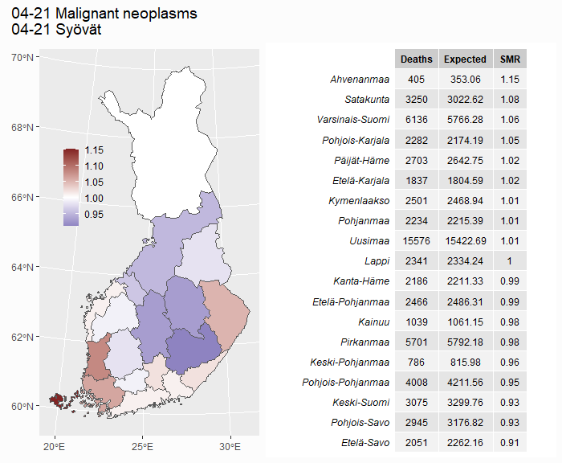


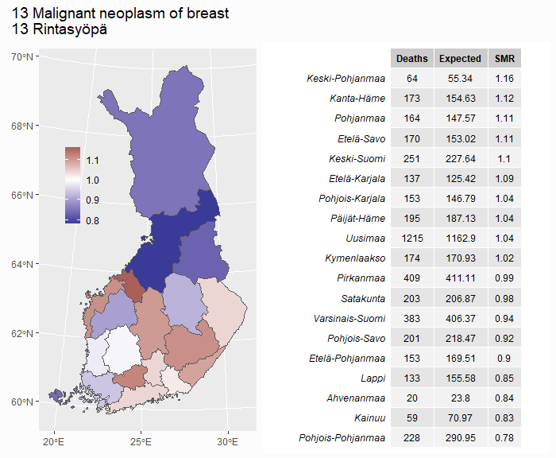


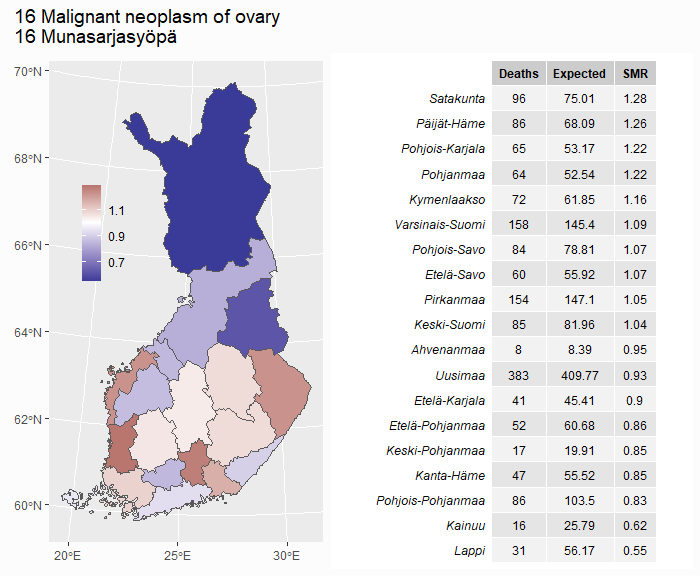
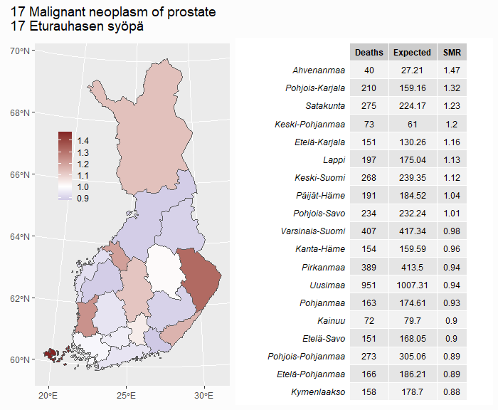


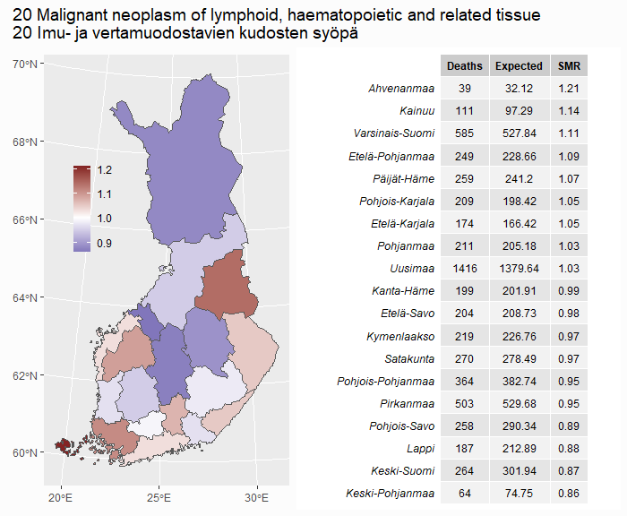


</div>
### 23-30 - Endocrine, nutritional, metabolic, circulatory
<button class="btn btn-light" data-toggle="collapse" data-target="#Block3"> Show/Hide </button>  
<div id="Block3" class="collapse">  
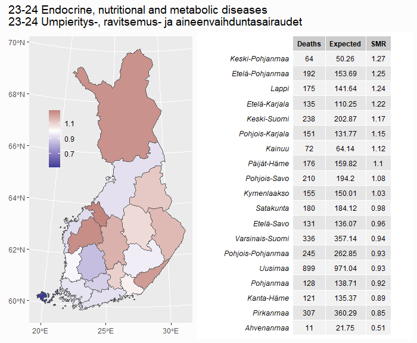


</div>
### 31-35 - Diseases of the respiratory system
<button class="btn btn-light" data-toggle="collapse" data-target="#Block4"> Show/Hide </button>  
<div id="Block4" class="collapse">  


</div>
### 36-39 - Other diseases
<button class="btn btn-light" data-toggle="collapse" data-target="#Block5"> Show/Hide </button>  
<div id="Block5" class="collapse">  


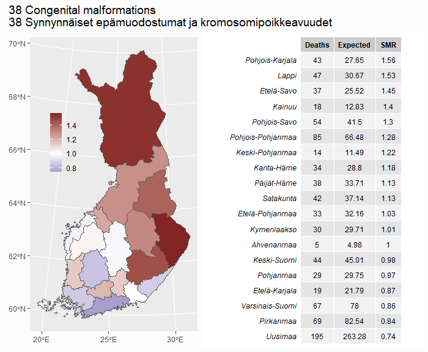

</div>
### 40-54 Alcohol-related, accidents, violence and unknown
<button class="btn btn-light" data-toggle="collapse" data-target="#Block6"> Show/Hide </button>  
<div id="Block6" class="collapse">  


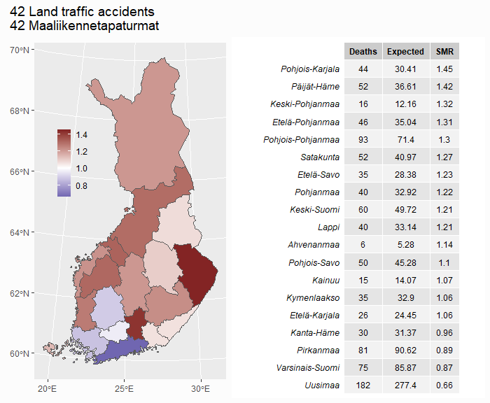
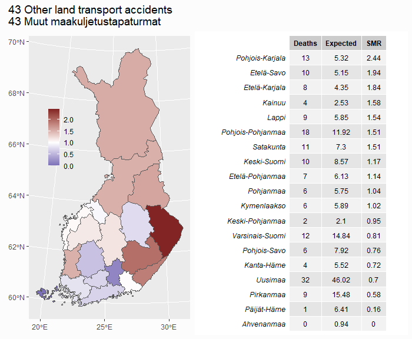
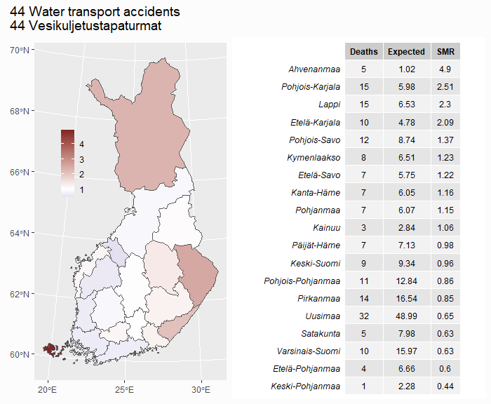
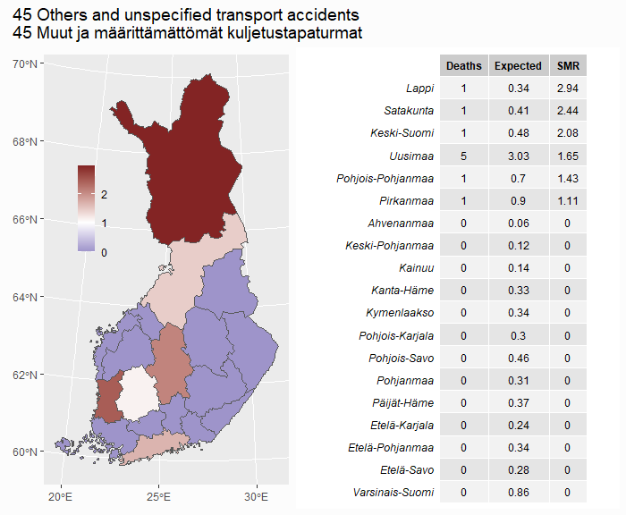


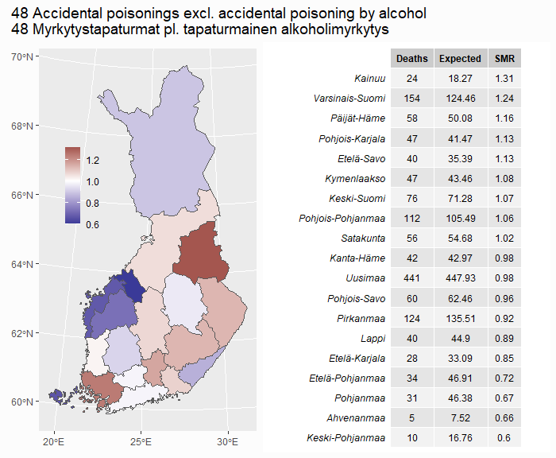


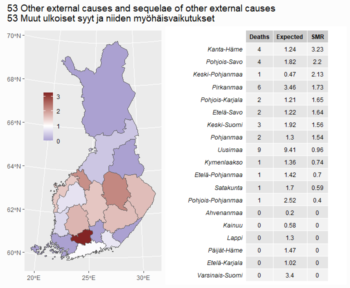

</div>
## By month

```{r Months}
# 12ah -- Deaths by month, 1945-2021
# https://statfin.stat.fi/PxWeb/pxweb/en/StatFin/StatFin__kuol/statfin_kuol_pxt_12ah.px/
px_12ah <- pxweb_get(url = 
"https://statfin.stat.fi:443/PxWeb/api/v1/en/StatFin/kuol/statfin_kuol_pxt_12ah.px",
 query = list("Tapahtumakuukausi" = c("M01", "M02", "M03", "M04", "M05", "M06",
                                      "M07", "M08", "M09", "M10", "M11", "M12"),
              "Tiedot"=c("*"), "Vuosi"=c("*")))

df_12ah <- as_tibble(as.data.frame(px_12ah, column.name.type = "text", variable.value.type = "text"))

# Vector of average days / month to calculate daily stats
avg_days_per_month = c(31, 28.25, 31, 30, 31, 30, 31, 31, 30, 31, 30, 31)

# Add daily deaths, short name for month and decade columns
df_12ah |>
  rename(Month = "Month of occurrence") |>
  mutate(Year = as.integer(Year),
         Month = as_factor(Month),
         Deaths_daily = as.integer(Deaths / avg_days_per_month),
         Month_short = as_factor(rep(month.abb, n()/12)),
         Decade = as.character(paste0(Year - Year %% 10, "s")),
         Decade = str_replace_all(Decade, "1940s", "1945-1949")
         ) -> df_12ah

# Calculate mean of daily deaths by month for 1945-2021 and create a plot
df_12ah |>
  group_by(Month) |>
  summarise(Deaths_daily = round(mean(Deaths_daily))) |>
  ggplot(aes(Month, Deaths_daily)) +
  geom_col(fill = "#393b15") +
  geom_text(aes(label = Deaths_daily), vjust = 1.5,
            color = "white", size = 4) +
  theme_bw() +
  labs(y = NULL,
       x = NULL) -> daily_deaths_month_plot

# Create the daily deaths by month by decade plots
df_12ah |>
  filter(Decade != "2020s") |>
  group_by(Decade, Month_short) |>
  summarise(Deaths_daily = round(mean(Deaths_daily))) |>
  ggplot(aes(Month_short, Deaths_daily)) +
  geom_col(fill = "#393b15") +
  theme_bw() +
  facet_wrap(vars(Decade), nrow = 2) +
  geom_text(aes(label = Deaths_daily),
            color = "white", size = 3.2, angle = 270, hjust = -0.1) +
  theme(axis.text.x = element_text(angle = 90, vjust = 0.15)) +
  labs(subtitle = "By decade",
       y = NULL,
       x = NULL,
       caption = "source: Tilastokeskus 12ah -- Deaths by month, 1945-2021"
       ) -> daily_deaths_decade_plot

# Combine the created plots and add annotations
plot_months <- daily_deaths_month_plot / daily_deaths_decade_plot +
  plot_annotation(title = "Daily deaths in Finland by month (1945-2021)",
                  subtitle = "Death rates are higher in winter months")

# Save as a picture
ggsave("images//2_plot_months.png", plot_months, device = "png", dpi = 96,
       width = 9, height = 9, units = c("in"))
```


## Life expectancy

```{r Longetivity}
# Notice: To create the second plots (region) in this section we are
# reusing df_region_map (created in the section Region and cause (2016 - 2020))

# 12am -- Life expectancy at birth by sex, 1751-2021
# https://statfin.stat.fi/PxWeb/pxweb/en/StatFin/StatFin__kuol/statfin_kuol_pxt_12am.px/
px_12am <- pxweb_get(url = 
"https://statfin.stat.fi:443/PxWeb/api/v1/en/StatFin/kuol/statfin_kuol_pxt_12am.px",
query = list( "Sukupuoli" = c("1", "2"), "Vuosi" = c("*"), "Tiedot" = c("*")))

df_12am <- as_tibble(as.data.frame(px_12am, column.name.type = "text", variable.value.type = "text"))

# Some years are in the form of "1751-1760", so mutate them to integers
df_12am |>
  rename(Life_exp = "Life expectancy at birth, years") |>
  mutate(Year = str_sub(Year, 1, 4)) |>
  mutate(Year = as.integer(Year),
         Sex = as_factor(Sex)) -> df_12am

# Create the first of four plots
ggplot(df_12am, aes(Year, Life_exp, color = Sex)) +
  geom_line(size = 1.1) +
  scale_color_manual(values = c("#6BA3D6", "#EA6B73")) +
  theme(plot.background = element_rect(fill = "#FCFCFC",
                                       colour = "#FCFCFC"),
        legend.position = c(0.25, 0.75),
        legend.background = element_blank(),
        plot.title = element_text(hjust = 0.06),
        plot.tag.position = c(0.2, 1)) +
  labs(subtitle = "Life expectancy by year (1751-2021)", y = "age", x = "year",
       caption = "source: Tilastokeskus 12am"
       ) -> life_plot_1

# 12ag -- Deaths by age (1-year) and sex, 1980-2021
# https://statfin.stat.fi/PxWeb/pxweb/en/StatFin/StatFin__kuol/statfin_kuol_pxt_12ag.px/
url = "https://statfin.stat.fi:443/PxWeb/api/v1/en/StatFin/kuol/statfin_kuol_pxt_12ag.px"
query = list("Sukupuoli" = c("1", "2"), "Tiedot"=c("*"), "Vuosi"=c("*"), "Ikä" = c("*"))
px_12ag <- pxweb_get(url = url, query = query)
df_12ag <- as_tibble(as.data.frame(px_12ag, column.name.type = "text", variable.value.type = "text"))

# Create the second plot
df_12ag |>
  group_by(Sex, Age) |>
  summarise(Deaths = sum(Deaths)) |>
  filter(Age != "Total") |>
  mutate(Age = as.integer(Age),
         Sex = as_factor(Sex),
         Deaths = Deaths / 41) |>
  ggplot(aes(x = Age, y = Deaths, color = Sex, fill = Sex)) +
  geom_line() +
  geom_area(alpha = 0.3, position = 'identity') +
  scale_color_manual(values = c('#EA6B73', '#6BA3D6')) +
  scale_fill_manual(values = c('#EA6B73', '#6BA3D6')) +
  scale_y_continuous(labels = scales::label_comma()) +
  labs(subtitle = "Deaths by age (1980-2021)",
       caption = "source: Tilastokeskus 12ag",
       x = "age", y = "yearly deaths") +
  theme(plot.background = element_rect(fill = "#FCFCFC",
                                       colour = "#FCFCFC"),
        legend.position = "none") -> life_plot_2

# 12ap -- Life table by age and sex, 1986-2020
# https://statfin.stat.fi/PxWeb/pxweb/en/StatFin/StatFin__kuol/statfin_kuol_pxt_12ap.px/
# This is used to to create the next three plots
px_12ap <- pxweb_get(url = 
"https://statfin.stat.fi:443/PxWeb/api/v1/en/StatFin/kuol/statfin_kuol_pxt_12ap.px",
query = list("Sukupuoli" = c("1", "2"), "Vuosi" = c("*"), "Tiedot" = c("*"),
             "Ikä" = c("*")))

df_12ap <- as_tibble(as.data.frame(px_12ap, column.name.type = "text", variable.value.type = "text"))

# Calculate yearly means from 1986-2020 data   
df_12ap |>
  mutate(Age = as.integer(Age),
         Year = as.integer(Year),
         Sex = as_factor(Sex)) |>
  rename(Life_exp = "Life expectancy, years",
         Survivors = "Survivors of 100,000 born alive",
         Death_prob = "Probability of death, per mille") |>
  group_by(Sex, Age) |>
  summarise(Life_exp = mean(Life_exp),
            Survivors = mean(Survivors),
            Death_prob = mean(Death_prob)) |>
  mutate(Death_prob = Death_prob / 10 # Changing to percent 
         ) -> df_12ap

# Function used to create plots 3-4
create_plot <- function(ycol, ylab, subtitle_1) {
  ggplot(df_12ap, aes(Age, .data[[ycol]], color = Sex)) +
    geom_line(size = 1.1, na.rm = T) +
    scale_color_manual(values = c("#6BA3D6", "#EA6B73")) +
    scale_y_continuous(labels = scales::label_comma()) +
    theme(plot.background = element_rect(fill = "#FCFCFC",
                                         colour = "#FCFCFC"),
          legend.position = "none") +
    labs(subtitle = subtitle_1, y = ylab, x = "age",
         caption = "source: Tilastokeskus 12ap")
}

# Create the plots 3-4
create_plot("Survivors", "survivors", "Estimated survival of 100,000 born alive (1986-2020)") -> life_plot_3
create_plot("Death_prob", "percent", "Yearly probability of death (1986-2020)") -> life_plot_4

# Combine and annotate plots 1-4
plot_life_exp_1 <- (life_plot_1 / life_plot_2 | life_plot_3 / life_plot_4) +
  plot_annotation(theme = theme(plot.background = element_rect(fill = "#FCFCFC",
                                                               colour = "#FCFCFC")),
                  title = "Longetivity by sex")

# Save image
ggsave("images//3_plot_life_exp_1.png", plot_life_exp_1, device = "png", dpi = 96,
       width = 9, height = 7, units = c("in"))

# 12an -- Life expectancy at birth by sex and region
# https://statfin.stat.fi/PxWeb/pxweb/en/StatFin/StatFin__kuol/statfin_kuol_pxt_12an.px/
px_12an <- pxweb_get(url = 
"https://statfin.stat.fi:443/PxWeb/api/v1/en/StatFin/kuol/statfin_kuol_pxt_12an.px",
query = list(
"Maakunta" = c("MK01", "MK02", "MK04", "MK05", "MK06", "MK07", "MK08", "MK09", "MK10", 
              "MK11", "MK12", "MK13", "MK14", "MK15", "MK16", "MK17", "MK18", "MK19", "MK21"),
"Vuosi" = c("2020"), "Sukupuoli" = c("1", "2"), "Tiedot" = c("*")))

df_12an <- as_tibble(as.data.frame(px_12an, column.name.type = "text", variable.value.type = "text"))

# Remove ID from region name
df_12an |> 
  rename(Life_exp = "Life expectancy at birth, years") |>
  mutate(Region = str_remove_all(Region, "MK.. ")) -> df_12an

# Add map. Notice: df_region_map was created in the section Region and cause (2016 - 2020)
df_region_map |>
  left_join(df_12an, by = c("Region")) -> df_life_region

# Create Females plot
df_life_region |>
  filter(Sex == "Females") |>
  ggplot() + 
  geom_sf(aes(geometry = geom, fill = Life_exp)) +
  scale_fill_distiller(palette = "Spectral", direction = 1, n.breaks = 9) +
  labs(subtitle = "Females", fill = NULL) +
  theme(plot.background = element_rect(fill = "#FCFCFC",
                                       colour = "#FCFCFC"),
        legend.position = c(0.15, 0.63),
        legend.background = element_blank(),
        legend.key.size = unit(0.4, "in"),
        legend.text = element_text(size = 9),
        panel.background = element_rect(colour = "#EA6B73"),
        plot.margin = margin(r = 1, unit = "cm"),
        plot.subtitle = element_text(size = 13)
  ) -> life_exp_region_f_plot

# Create Males plot
df_life_region |>
  filter(Sex == "Males") |>
  ggplot() + 
  geom_sf(aes(geometry = geom, fill = Life_exp)) +
  scale_fill_distiller(palette = "Spectral", direction = 1, n.breaks = 9) +
  labs(subtitle = "Males", fill = NULL) +
  theme(plot.background = element_rect(fill = "#FCFCFC",
                                       colour = "#FCFCFC"),
        legend.position = c(0.15, 0.63),
        legend.background = element_blank(),
        legend.key.size = unit(0.4, "in"),
        legend.text = element_text(size = 9),
        panel.background = element_rect(colour = "#6BA3D6"),
        plot.subtitle = element_text(size = 13)
  ) -> life_exp_region_m_plot

# Combine and annotate region plots
plot_life_exp_2 <- life_exp_region_f_plot + life_exp_region_m_plot +
  plot_annotation(theme = theme(plot.background = element_rect(fill = "#FCFCFC",
                                                                     colour = "#FCFCFC")),
    title = "Life expectancy by region (2018-2020)",
    caption = "source: Tilastokeskus 12an -- Life expectancy at birth by sex and region")

# Save image
ggsave("images//3_plot_life_exp_2.png", plot_life_exp_2, device = "png", dpi = 96,
       width = 7, height = 6.3, units = c("in"))
```
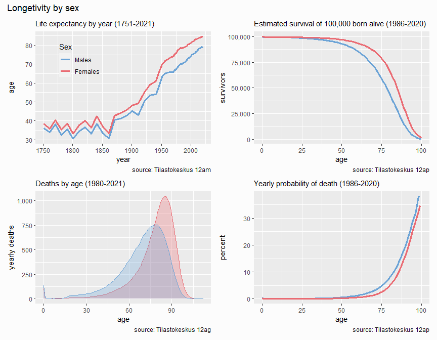 

## Suicides
```{r Suicides}
# 11by -- Suicides by age and gender, 1921-2020
# https://statfin.stat.fi/PxWeb/pxweb/en/StatFin/StatFin__ksyyt/statfin_ksyyt_pxt_11by.px/
url = "https://statfin.stat.fi:443/PxWeb/api/v1/en/StatFin/ksyyt/statfin_ksyyt_pxt_11by.px"
query = list("Sukupuoli" = c("1", "2"), "Tiedot"=c("*"), "Vuosi"=c("*"), "Ikä" = c("*"))
px_11by <- pxweb_get(url = url, query = query)
df_11by <- as_tibble(as.data.frame(px_11by, column.name.type = "text", variable.value.type = "text"))

# Create the yearly plot
df_11by |>
  filter(Age == "Total") |>
  mutate(Year = as.integer(Year),
         Sex = as_factor(Gender)) |>
  ggplot(aes(Year, Suicides, color = Sex)) +
  geom_line(size = 1.1) +
  scale_color_manual(values = c('#6BA3D6', '#EA6B73')) +
  theme(plot.background = element_rect(fill = "#FCFCFC",
                                       colour = "#FCFCFC"),
        legend.position = c(0.08, 0.9),
        legend.background = element_blank(),
        legend.title = element_blank()) +
  labs(subtitle = "By year",
       y = NULL,
       x = NULL) -> s_plot_1

# Create the age group plot
df_11by |>
  filter(Age != "Total") |>
  group_by(Age, Gender) |>
  summarise(Suicides = sum(Suicides)) |>
  mutate(Age = as_factor(Age),
         Sex = as_factor(Gender)) |>
  ggplot(aes(Sex, Suicides, fill = Age)) +
  geom_col(position = "dodge") +
  scale_y_continuous(expand = expansion(mult = c(0))) +
  paletteer::scale_fill_paletteer_d("ggthemes::manyeys") +
  guides(fill = guide_legend(ncol = 2, byrow = F)) +
  theme(plot.background = element_rect(fill = "#FCFCFC",
                                       colour = "#FCFCFC"),
        legend.position = c(0.12, 0.68),
        legend.background = element_blank(),
        legend.title = element_blank()) +
  labs(subtitle = "By age group",
       y = NULL,
       x = NULL) +
  annotate("rect", xmin = 0.45, xmax = 1.49, ymin = 0, ymax = Inf,
           color = "#EA6B73", fill = NA) +
  annotate("rect", xmin = 1.51, xmax = 2.55, ymin = 0, ymax = Inf,
           color = "#6BA3D6", fill = NA) -> s_plot_2

# Combine and annotate
plot_s_1 <- (s_plot_1 / s_plot_2) +
  plot_annotation(theme = theme(plot.background = element_rect(fill = "#FCFCFC",
                                                               colour = "#FCFCFC")),
                  title = "Suicides (1921-2020)",
                  caption = "source: Tilastokeskus 11by -- Suicides by age and gender, 1921-2020")

# Save image
ggsave("images//4_plot_s_1.png", plot_s_1, device = "png", dpi = 96,
       width = 9, height = 8, units = c("in"))
  
# 12ef -- Accidental and violent deaths by underlying cause of death, 1998-2020
# https://statfin.stat.fi/PxWeb/pxweb/en/StatFin/StatFin__ksyyt/statfin_ksyyt_pxt_12ef.px/
url = "https://statfin.stat.fi:443/PxWeb/api/v1/en/StatFin/ksyyt/statfin_ksyyt_pxt_12ef.px"
query = list("Sukupuoli" = c("1", "2"), "Tiedot"=c("ksyylkm3"), "Vuosi"=c("*"),
             "Ikä" = c("SSS"), "Tapaturmat ja väkivalta (ulkoisten syiden luokitus)" =
               c("073", "074", "075", "076", "077", "078", "079", "080", "081",
                 "082", "083", "084", "085", "086", "087", "088", "089", "090",
                 "091", "092", "093", "094", "095", "096", "097"))
px_12ef <- pxweb_get(url = url, query = query)
df_12ef <- as_tibble(as.data.frame(px_12ef, column.name.type = "text", variable.value.type = "text"))

# Combine years and shorten the names of causes
df_12ef |>
  rename(Cause = "Accidents and violence (short list of external causes)",
         Deaths = "Total accidental and violent deaths",
         Sex = "Gender") |>
  group_by(Cause, Sex) |>
  summarise(Deaths = sum(Deaths)) |>
  mutate(Sex = as_factor(Sex),
         Cause = str_remove(Cause, "[:digit:]{3}[:space:]Suicide "),
         Cause = str_remove(Cause, "^by "),
         Cause = str_to_sentence(Cause),
         Cause = str_replace(Cause, "autonomic nervous system", "ANS")
  ) -> df_12ef

# Calculate factor levels for Cause (fewest total deaths to highest)
df_12ef |>
  group_by(Cause) |>
  summarise(Deaths = sum(Deaths)) |>
  filter(Deaths > 0) |>
  arrange(Deaths) |>
  pull(Cause) -> cause_levels

# Set levels for Cause, create plot
df_12ef |>
  filter(Cause %in% cause_levels) |> # Filter out those causes with 0 deaths
  mutate(Cause = factor(Cause, levels = cause_levels)) |>
  ggplot(aes(Cause, Deaths, fill = Sex)) +
  geom_col() +
  scale_fill_manual(values = c("#EA6B73", "#6BA3D6")) +
  scale_x_discrete(expand = expansion(mult = c(0, 0))) +
  scale_y_continuous(expand = expansion(mult = c(0, 0))) +
  coord_flip() +
  labs(subtitle = "By method (1998 - 2020)",
       caption = "source: Tilastokeskus 12ef -- Accidental and violent deaths by underlying cause of death, 1998-2020",
       x = NULL, y = NULL) +
  theme(plot.background = element_rect(fill = "#FCFCFC",
                                       colour = "#FCFCFC"),
        legend.position = c(0.91, 0.2),
        legend.background = element_blank(),
        legend.title = element_blank(),
        axis.text.y = element_text(size = 10),
        plot.title.position = "plot",
        plot.subtitle = element_text(hjust = 0.06)) -> plot_s_2

# Save picture
ggsave("images//4_plot_s_2.png", plot_s_2, device = "png", dpi = 96,
       width = 9, height = 7, units = c("in"))

# 12z6 -- Deaths by month, underlying cause of death and gender, 1971M01-2020M12
# https://statfin.stat.fi/PxWeb/pxweb/en/StatFin/StatFin__ksyyt/statfin_ksyyt_pxt_12z6.px/
url = "https://statfin.stat.fi:443/PxWeb/api/v1/en/StatFin/ksyyt/statfin_ksyyt_pxt_12z6.px"
query = list("Sukupuoli" = c("1", "2"), "Tiedot"=c("*"), "Kuukausi"=c("*"),
             "Tilaston peruskuolemansyy (aikasarjaluokitus)" = c("50"))
px_12z6_50 <- pxweb_get(url = url, query = query)
df_12z6_50 <- as_tibble(as.data.frame(px_12z6_50, column.name.type = "text", variable.value.type = "text"))

# Combine years, give months short names, calculate daily deaths 
df_12z6_50 |>
  separate(Month, into = c("Year", "Month"), sep = "M") |>
  group_by(Month, Gender) |>
  summarise(Deaths = mean(Deaths)) |>
  ungroup() |>
  mutate(Month = case_when(Month == "01" ~ "Jan",
                           Month == "02" ~ "Feb",
                           Month == "03" ~ "Mar",
                           Month == "04" ~ "Apr",
                           Month == "05" ~ "May",
                           Month == "06" ~ "Jun",
                           Month == "07" ~ "Jul",
                           Month == "08" ~ "Aug",
                           Month == "09" ~ "Sep",
                           Month == "10" ~ "Oct",
                           Month == "11" ~ "Nov",
                           Month == "12" ~ "Dec"),
         Month = as_factor(Month),
         Days_in_month = rep(c(31, 28.25, 31, 30, 31, 30, 31, 31, 30, 31, 30, 31), each = 2),
         Deaths_daily = round(Deaths / Days_in_month, 2)) -> df_12z6_50

# Function for creating the monthly plots
create_plot <- function(gender, panel_color) {
  df_12z6_50 |>
    filter(Gender == gender) |>
    ggplot(aes(Month, Deaths_daily)) +
    geom_col(fill = "#593112") +
    geom_text(aes(label = Deaths_daily), vjust = 1.5,
              color = "white", size = 4) +
    theme_bw() +
    labs(subtitle = gender,
         y = NULL,
         x = NULL) +
    theme(plot.background = element_rect(fill = "#FCFCFC",
                                         colour = "#FCFCFC"),
          panel.border = element_rect(colour = panel_color))
}

# Create monthly plots
create_plot("Females", "#EA6B73") -> F_plot
create_plot("Males", "#6BA3D6") -> M_plot

# Combine and annotate
(F_plot / M_plot) +
plot_annotation(theme = theme(plot.background = element_rect(fill = "#FCFCFC",
                                                             colour = "#FCFCFC")),
                title = "Daily suicides by month (Jan 1971 - Dec 2020)",
                subtitle = "Warmer months have higher suicide rates",
                caption = "source: Tilastokeskus 2z6 -- Deaths by month, underlying cause of death and gender"
                ) -> plot_s_3

# Save as picture
ggsave("images//4_plot_s_3.png", plot_s_3, device = "png", dpi = 96,
       width = 9, height = 7, units = c("in"))
```
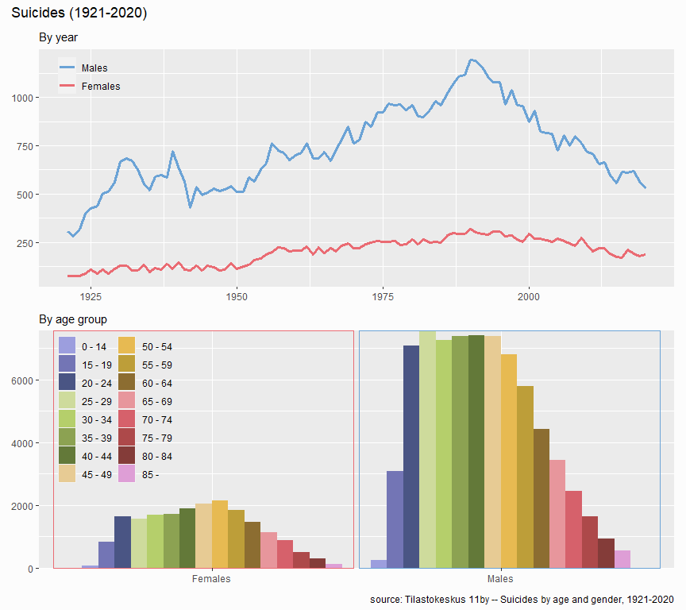  
